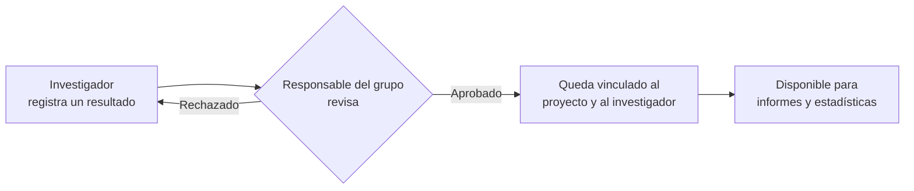

# Introducción a Science Manager

**Science Manager** es la plataforma donde tu grupo de investigación reúne, en un único lugar, todo lo que produce: artículos científicos, proyectos, congresos, patentes, actividades de divulgación y los perfiles de cada investigador.

En lugar de tener esa información repartida entre hojas de cálculo, correos electrónicos y carpetas compartidas, Science Manager ofrece un **único punto de verdad**: cada dato se registra una vez y queda disponible para toda la vida académica del grupo — consulta, seguimiento y elaboración de informes.

## ¿Qué significa esto para ti?

Si perteneces a un grupo de investigación, Science Manager te permite:

- **Registrar tus publicaciones** y demás resultados de investigación (congresos, patentes, divulgación, capítulos de libro) en pocos minutos.
- **Mantener tu perfil académico actualizado**: ORCID, categoría, tramos de investigación, historial de contratos.
- **Ver de un vistazo** qué has publicado, en qué proyectos participas y el estado de cada cosa que has enviado.
- **Dejar de perseguir el factor de impacto a mano**: la plataforma lo resuelve automáticamente a partir de los datos oficiales de citación.
- **Generar informes** (para acreditaciones, memorias de proyecto, convocatorias) sin tener que recopilar datos de media docena de sitios distintos.

## Un flujo de trabajo sencillo

Da igual si eres investigador principal, profesor o estudiante de doctorado: el ciclo de vida de cualquier resultado de investigación sigue siempre el mismo camino.

1. **Registras** una publicación, congreso, patente o cualquier otro resultado.
2. Queda en estado *pendiente* hasta que el investigador principal o el administrador del grupo lo **revisa y aprueba**.
3. Una vez aprobado, el resultado queda **vinculado** a ti, al proyecto correspondiente y, si aplica, a la revista — con su factor de impacto y cuartil ya resueltos.
4. A partir de ahí, forma parte de los **informes y estadísticas** del grupo, sin que nadie tenga que volver a teclearlo.

## ¿Quién usa Science Manager?

| Perfil | Qué hace en la plataforma |
|---|---|
| **Investigador principal (IP)** | Supervisa la producción del grupo, aprueba actividades y consulta indicadores de impacto. |
| **Profesor / Investigador** | Registra sus publicaciones y resultados, mantiene su perfil académico al día. |
| **Estudiante de doctorado** | Registra sus contribuciones y mantiene su perfil vinculado a su director de tesis. |
| **Administrador del grupo** | Gestiona usuarios, importa datos y configura revistas y entidades financiadoras. |

## Siguientes pasos

Continúa por [Modelo de Roles y Accesos](./02-roles-and-access.md) para entender qué puede ver y hacer cada perfil, o salta directamente a [Proyectos de Investigación](../02-core-features/01-projects.md) si ya tienes claro tu rol.
