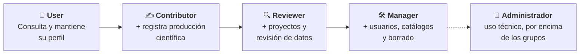

# Modelo de Roles y Accesos

Cada persona que entra en Science Manager tiene un **rol** asignado. El rol decide qué módulos ves en el menú, qué botones aparecen en cada pantalla y qué datos puedes consultar o modificar. Esta página explica quién es quién; en el resto de la documentación, cuando se menciona un rol (por ejemplo «solo Manager»), se refiere a las definiciones de aquí.

## 🧭 Los roles de un vistazo \{#los-roles-de-un-vistazo}

Los roles son **acumulativos**: cada uno puede hacer todo lo que hace el anterior y algo más.

| Rol | Quién es | Para qué se usa |
|---|---|---|
| **User** | Miembro del grupo con acceso básico | Consultar la información del grupo y mantener su propio perfil |
| **Contributor** | Investigador o estudiante que aporta producción científica | Registrar y editar sus propias publicaciones, capítulos de libro y contribuciones |
| **Reviewer** | Investigador principal (IP) o investigador senior | Solicitar y registrar proyectos, y revisar la información que se introduce en el sistema |
| **Manager** | Gestor del grupo | Dar de alta y gestionar usuarios, mantener los catálogos y eliminar registros |

Además existe el rol **Administrador**, de uso técnico: lo ejerce quien mantiene la instalación de Science Manager y trabaja por encima de los grupos. Como usuario del día a día no necesitas interactuar con él.

:::note[Un rol por persona]

Cada usuario tiene un único rol, y ese rol incluye los permisos de todos los inferiores. Un Manager, por ejemplo, también puede hacer todo lo que hace un Reviewer.

:::

Cada escalón añade permisos a los del anterior:

## 🔍 Reviewer \{#reviewer}

El **Reviewer** es el rol de la **gestión científica** del grupo, pensado para investigadores principales y personal investigador senior. Tiene dos responsabilidades:

**1. Pedir proyectos.** Es quien puede dar de alta y editar proyectos de investigación, incluidas las solicitudes que aún no se han concedido. El botón **Nuevo Proyecto** solo aparece a Reviewer y Manager. Más detalles en [Proyectos](../02-core-features/01-projects.md).

**2. Revisar la información del sistema.** Un Reviewer puede consultar y corregir lo que otras personas han registrado, para asegurar que los datos del grupo son correctos. En concreto puede:

- Editar publicaciones de otros miembros del grupo.
- Crear eventos y editar cualquier contribución, y marcar como revisados los avisos de las importaciones desde CSV.
- Completar y corregir los estudios de [dirección académica](../02-core-features/03-academic-direction.md) del grupo y consultar su historial de cambios.
- Crear y editar patentes.
- Ver los datos personales sensibles de los miembros (nacionalidad, DNI, fecha de nacimiento) y consultar la sección de contratos.
- Generar informes de grupo y de proyecto.

Un Reviewer **no** gestiona usuarios, **no** puede eliminar registros y **no** edita los catálogos maestros (revistas, entidades financiadoras). Esas tareas son del Manager.

## 🛠️ Manager (Gestor) \{#manager-gestor}

El **Manager** es quien **da de alta y gestiona los usuarios** del grupo: crea las cuentas, asigna a cada persona su rol y mantiene sus vinculaciones. Es también el responsable de la calidad de los datos de referencia y de la limpieza del sistema. Además de todo lo que hace un Reviewer, puede:

- Dar de alta usuarios, editar los perfiles de otras personas y asignar roles.
- Registrar y editar las **vinculaciones** (contratos y relación con el grupo) de cada persona.
- Mantener los catálogos compartidos, como [revistas](../02-core-features/09-journals.md) y sus métricas JCR.
- **Eliminar** registros (publicaciones, estancias, eventos, estudios, capítulos de libro…). Ningún otro rol puede borrar.
- Hacer altas manuales que el resto de roles no tiene, como registrar un estudio a nombre de otra persona o añadir estancias a otros miembros.
- Validar los datos económicos de las dietas de eventos.

Consulta [Gestión de Usuarios](../04-administration/01-user-management.md) para el detalle del alta y la asignación de roles.

## ✍️ Contributor y User \{#contributor-y-user}

El **Contributor** aporta producción científica: puede crear publicaciones, capítulos de libro y contribuciones a eventos, y editar **solo lo que él mismo ha creado** o donde figura como autor.

El **User** es el perfil de consulta. Ve la información general del grupo y su propio perfil, pero no puede crear contenido ni accede a módulos como [Revistas](../02-core-features/09-journals.md).

## ✅ Qué puede hacer cada rol \{#qué-puede-hacer-cada-rol}

Resumen de las acciones más habituales. En cada módulo de [Funcionalidades principales](../02-core-features/01-projects.md) encontrarás el detalle exacto en su apartado de permisos.

| Acción | User | Contributor | Reviewer | Manager |
|---|:---:|:---:|:---:|:---:|
| Consultar la información del grupo | ✅ | ✅ | ✅ | ✅ |
| Editar el perfil propio | ✅ | ✅ | ✅ | ✅ |
| Crear publicaciones y capítulos de libro | — | ✅ | ✅ | ✅ |
| Editar lo creado por otras personas | — | — | ✅ (según el módulo) | ✅ |
| Crear y editar proyectos | — | — | ✅ | ✅ |
| Crear eventos | — | — | ✅ | ✅ |
| Ver DNI, nacionalidad y contratos | — | — | ✅ | ✅ |
| Generar informes de grupo y proyecto | — | — | ✅ | ✅ |
| Dar de alta y gestionar usuarios | — | — | — | ✅ |
| Mantener catálogos (revistas, financiadoras) | — | — | — | ✅ |
| Eliminar registros | — | — | — | ✅ |

:::tip[¿No ves un botón?]

Si una opción no aparece en el menú o en una ficha, es que tu rol no tiene permiso para ella. No es un error de carga. Si necesitas más permisos, pídeselos a un Manager de tu grupo.

:::
