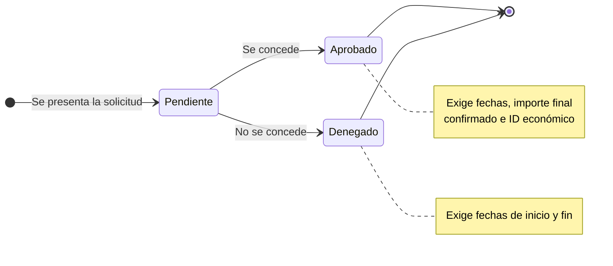

# Proyectos de Investigación

El módulo **Proyectos** es el registro histórico completo del grupo: incluye los proyectos **activos** y los **finalizados**, y también **todas las solicitudes** presentadas a lo largo del tiempo, tanto las concedidas como las denegadas o aún pendientes de resolución.

## 🔎 Listado, búsqueda y filtros \{#listado-búsqueda-y-filtros}

Accede desde **Investigación → Proyectos**. La tabla muestra el código, el título con su entidad financiadora y fechas, el investigador principal (IP), el importe y el avance temporal de cada proyecto.

*Listado de proyectos con el panel de filtros abierto.*

- **Búsqueda rápida:** el cuadro superior filtra por **título** mientras escribes.
- **Filtros avanzados:** el botón de filtros despliega un panel con **Entidad financiadora**, **Investigador**, **Año**, **Código** y **Estado** (activo / finalizado). Pulsa **Aplicar filtros** para confirmarlos; **Limpiar** los elimina.
- Los proyectos activos aparecen primero.

## ➕ Crear un nuevo proyecto \{#crear-un-nuevo-proyecto}

:::info[🔐 Permisos requeridos]

Consulta qué es cada rol en [Modelo de Roles y Accesos](../01-getting-started/02-roles-and-access.md).

La creación y edición de proyectos está disponible para los roles **Reviewer** y **Manager**. Para el resto de usuarios el botón **Nuevo Proyecto** no aparece.

:::

Pulsa **Nuevo Proyecto**, rellena el formulario y confirma con **Crear Proyecto**.

### 1. Datos identificativos y responsable

Introduce el **Título** (obligatorio), el **Código de proyecto** y el **Investigador Principal (IP)**, que es obligatorio para poder registrar el proyecto. El **Acrónimo** se rellena al final del formulario, en *Datos para informes de justificación*.

### 2. Estado de la solicitud

En Science Manager se registran **todas las peticiones de proyectos** del grupo, las que se conceden y las que no, para mantener un historial real de solicitudes. Cada proyecto tiene uno de estos estados:

| Estado | Significado |
|---|---|
| **Pendiente** | Solicitud presentada, aún sin resolución. |
| **Aprobado** | Proyecto concedido. |
| **Denegado** | Solicitud no concedida. |

*Formulario con el estado «Pendiente»: las fechas y el importe final todavía no se exigen.*

**Ciclo de vida de una solicitud:**

### 3. El formulario cambia según el estado

:::warning[Campos obligatorios al aprobar un proyecto]

Al cambiar el estado a **Aprobado**, el formulario muestra el campo **Importe Final (Confirmado)** y exige, además de los campos comunes:

- **Fecha de Inicio** y **Fecha de Fin**.
- **Importe Final (Confirmado)**: el importe concedido suele diferir del solicitado, que se anota aparte en *Importe Total*.
- **ID Económico**.

:::

| Campo | Pendiente | Denegado | Aprobado |
|---|:---:|:---:|:---:|
| Título, código, entidad financiadora, ID y etiqueta de convocatoria, IP | Obligatorio | Obligatorio | Obligatorio |
| Fecha de inicio y fin | Opcional | **Obligatorio** | **Obligatorio** |
| Importe final confirmado | No se muestra | No se muestra | **Obligatorio** |
| ID Económico | Opcional | Opcional | **Obligatorio** |

*Con el estado «Aprobado», las fechas, el importe final y el ID económico (resaltados) pasan a ser obligatorios.*

### 4. Financiación, convocatoria y agradecimientos

- **Financiación:** importe total solicitado y **Entidad financiadora**, que se elige del catálogo de entidades del grupo.
- **Convocatoria:** **ID de convocatoria** y **Etiqueta de convocatoria**, ambos obligatorios.
- **Agradecimientos:** texto oficial que la entidad financiadora exige citar en las publicaciones vinculadas al proyecto.
- **Datos para informes de justificación:** acrónimo, modalidad, área, subárea, prioridad temática y modificaciones. Aparecen en la sección «Datos del proyecto» de los informes de justificación.

### 5. Guardar

Revisa los datos y pulsa **Crear Proyecto**. Si falta algún campo obligatorio, el formulario te indica cuáles antes de guardar.

:::tip

Si todavía no tienes la resolución, crea el proyecto como **Pendiente** y edítalo cuando se conceda: al pasar a **Aprobado** se te pedirán las fechas y los importes definitivos.

:::
