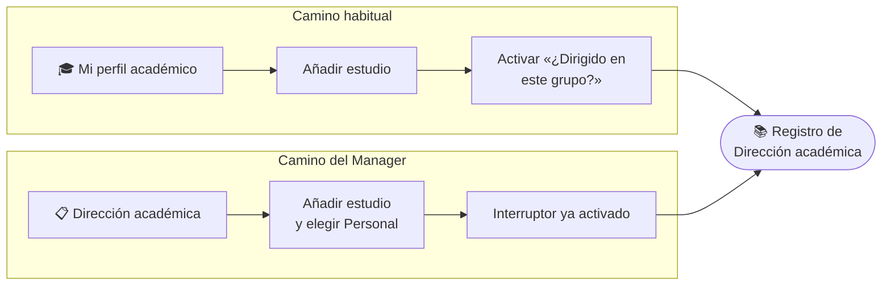
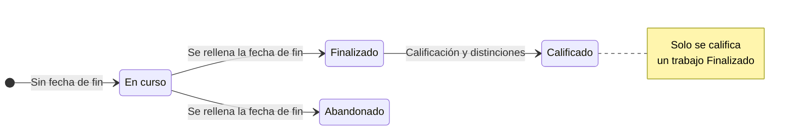

# Dirección Académica

El módulo **Dirección académica** es el registro de las **tesis doctorales, Trabajos Fin de Máster (TFM) y Trabajos Fin de Grado (TFG)** dirigidos dentro del grupo. Cada registro indica quién es el estudiante, qué título tiene el trabajo, quiénes lo dirigen, en qué estado está y con qué proyectos de investigación se justifica.

:::note[Mismo dato que el perfil académico]

No es una lista aparte: reúne los estudios del **perfil académico** de cada persona (**Mi perfil académico**) que están marcados como *dirigidos en el grupo*. Si un estudio no tiene activado ese interruptor, no aparece aquí.

:::

## 🔎 Listado y búsqueda \{#listado-y-búsqueda}

Accede desde **Investigación → Dirección académica**. La tabla muestra, para cada trabajo:

- **Personal:** el estudiante, con la titulación (Doctorado, Máster o Grado).
- **Título del trabajo.**
- **Directores:** avatares de los directores, con su rol (Director/a, Codirector/a o Tutor/a) al pasar el ratón.
- **Estado:** *En curso*, *Finalizado* o *Abandonado*.

El orden lo fija el servidor: primero los trabajos con fecha de fin más reciente. Al pie eliges cuántas filas ver por página (10, 25, 50 o 100).

*Registro de trabajos dirigidos en el grupo.*

- **Búsqueda rápida:** el cuadro superior filtra por **título del trabajo** mientras escribes.
- **Abrir un trabajo:** pulsa sobre la fila para ver su ficha.
- **Menú de tres puntos:** ofrece **Editar** y **Eliminar**; cada opción aparece deshabilitada si tu rol no la permite (ver [permisos](#permisos-requeridos)).

### Filtros avanzados

El botón de filtros despliega un panel **Filtrar por** con siete selectores de selección múltiple:

| Filtro | Qué filtra |
|---|---|
| **Personal** | Estudiante o investigador propietario del estudio |
| **Titulación** | Doctorado, Máster o Grado |
| **Estado** | En curso, Finalizado o Abandonado |
| **Calificación** | Cum Laude, Sobresaliente, Notable, Bien, Aprobado, Suspenso o No aplica |
| **Directores** | Autores que figuran como directores |
| **Proyectos asociados** | Proyectos con los que se justifica el trabajo |
| **Curso académico** | Cursos desde 2010; «2025/26» empieza en septiembre de 2025 |

Pulsa **Aplicar filtros** para confirmarlos y **Limpiar filtros** para quitarlos. El botón muestra cuántos grupos de filtros hay activos. Los filtros quedan en la dirección web, de modo que puedes **compartir un listado ya filtrado** copiando el enlace.

*Panel de filtros abierto sobre el listado.*

## 📄 Consultar un trabajo \{#consultar-un-trabajo}

La ficha de detalle muestra el título del trabajo, el estudiante, la titulación y su estado, los **directores** con su rol, el programa, la universidad, las fechas, la **calificación** y las **distinciones** (mención internacional y premio extraordinario), los **proyectos asociados** (con enlace) y quién registró el estudio.

En un doctorado con mención internacional, la ficha desglosa además las **estancias que cuentan para la mención internacional**.

El menú de tres puntos de la ficha da acceso a **Editar**, **Eliminar** y **Ver historial** (registro de auditoría).

*Detalle de una tesis en curso con sus directores y proyecto asociado.*

## 🔐 Permisos requeridos \{#permisos-requeridos}

:::info[🔐 Permisos requeridos]

Consulta qué es cada rol en [Modelo de Roles y Accesos](../01-getting-started/02-roles-and-access.md).

| Acción | Quién puede |
|---|---|
| Consultar el listado y las fichas | Cualquier usuario del grupo |
| Registrar un estudio a nombre de otra persona (**Añadir estudio**) | Manager |
| Editar un estudio | El propietario, el Reviewer y el Manager del grupo; además, quien lo registró o figura como director en un estudio dirigido en el grupo |
| Eliminar un estudio | Solo Manager |
| Ver el historial de cambios | Reviewer o superior |

:::

Un estudio eliminado pasa a la papelera y deja de aparecer en el listado; un gestor puede restaurarlo.

## ➕ Registrar un trabajo \{#registrar-un-trabajo}

Hay dos caminos:

1. **Desde el perfil académico (lo habitual).** Cada persona añade su estudio en **Mi perfil académico** y activa **¿Este trabajo se desarrolla o se ha dirigido dentro de este grupo de investigación?**. Al activarlo, el trabajo pasa a este registro; al desactivarlo, sale de él, pero el título, los directores y los proyectos se conservan.
2. **Desde esta página (Manager).** Pulsa **Añadir estudio**, elige en **Personal** al investigador o estudiante propietario y completa el formulario. El interruptor de dirección en el grupo ya viene activado.

*Formulario para registrar un estudio a nombre de otra persona; el título del trabajo aparece resaltado.*

**Dos caminos, un mismo registro:**

**Estados de un trabajo:**

### Campos y comportamiento dinámico

Los campos de base son **Titulación**, **Estado**, **Título de la titulación**\*, **País**, **Universidad o institución**\*, **Fecha de inicio**\* y **Fecha de fin**. Al activar el interruptor de dirección en el grupo se despliega el bloque del trabajo:

- **Título del trabajo**\*, **Programa o titulación**\*, **Directores**\* (se eligen del padrón de autores del grupo; los externos deben darse de alta antes) y **Proyectos asociados**\*.
- **Calificación**, **Nota numérica (0–10)**, **Mención internacional** y **Premio extraordinario**.

:::warning[Reglas que bloquean el guardado]

- Un trabajo **dirigido en el grupo** exige título del trabajo, programa, al menos un director y al menos un proyecto asociado.
- Si el grupo **aún no tiene proyectos**, el interruptor está deshabilitado: crea primero un proyecto.
- Un trabajo **En curso** no puede tener **Fecha de fin**; *Finalizado* y *Abandonado* sí la exigen. La fecha de fin no puede ser posterior a hoy ni anterior a la de inicio.
- Solo se puede **calificar un trabajo Finalizado**; la nota numérica debe estar entre 0 y 10.
- Si marcas **Premio extraordinario**, debes escribir su descripción.

:::

Si no cambias el **Estado**, se deduce de la fecha de fin: al rellenarla pasa a *Finalizado* y al vaciarla vuelve a *En curso*.

:::tip[Completar los datos oficiales]

Quien registra un trabajo puede dejar sin rellenar el estado final, la calificación y las distinciones: los revisores del grupo pueden completarlos más tarde editando el estudio.

:::
