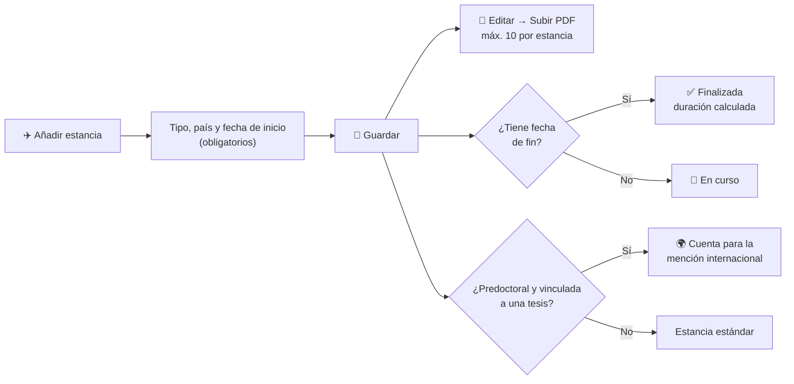

# Estancias de Investigación

El módulo **Estancias** es el registro de las estancias de investigación, nacionales e internacionales, de todo el personal del grupo. Cada estancia indica quién la realiza, en qué institución de acogida, cuándo y con qué financiación, y puede vincularse a una **tesis** para justificar la mención internacional del doctorado.

## 🔎 Listado, búsqueda y filtros \{#listado-búsqueda-y-filtros}

Accede desde **Investigación → Estancias**. La tabla muestra, para cada estancia, el **Personal** (con su tipo de estancia), la **Institución de acogida**, el **País**, la **Duración (meses)** y el **Estado**: **Finalizada** si tiene fecha de fin y **En curso** si todavía no la tiene.

*Listado de estancias del grupo.*

- **Búsqueda rápida:** el cuadro superior filtra por **institución de acogida** mientras escribes.
- **Paginación:** al pie de la tabla eliges cuántas filas ver por página.
- **Abrir una estancia:** pulsa sobre la fila para ver su ficha de detalle.

### Filtros avanzados

El botón de filtros despliega un panel con tres selectores: **Personal**, **Tipo de estancia** (Predoctoral, Postdoctoral, Profesor/a visitante u Otra) y **País**. Pulsa **Aplicar** para confirmarlos y **Limpiar filtros** para quitarlos. El botón muestra cuántos filtros hay activos y el listado filtrado se puede compartir como enlace.

*Panel de filtros abierto sobre el listado.*

## 📄 Consultar una estancia \{#consultar-una-estancia}

La ficha de detalle muestra el tipo y el estado de la estancia, la persona, la institución, el departamento y el supervisor/a de acogida, el país y la ciudad, las fechas, la duración, los **proyectos asociados** (con enlace a cada proyecto), los objetivos y los documentos justificativos. Si la estancia está vinculada a una tesis, aparece la etiqueta **Cuenta para mención internacional**.

*Ficha de una estancia finalizada.*

## ➕ Añadir una estancia \{#añadir-una-estancia}

:::info[🔐 Permisos requeridos]

Consulta qué es cada rol en [Modelo de Roles y Accesos](../01-getting-started/02-roles-and-access.md).

| Acción | Quién puede |
|---|---|
| Consultar el listado y las fichas | Cualquier usuario del grupo |
| **Añadir estancia** | Cualquier usuario autenticado del grupo |
| **Editar** una estancia | La persona a la que pertenece, quien la registró y los **Manager** |
| **Eliminar** una estancia | Solo **Manager** |

Un **Reviewer** consulta todas las estancias, pero solo puede editar las suyas o las que él mismo registró. Si no tienes permiso, la opción no aparece en el menú de la ficha.

:::

Pulsa **Añadir estancia** y rellena el formulario.

*Formulario de alta con fechas y objetivos rellenados.*

1. **Investigador:** la persona a la que pertenece la estancia. Si no eliges a nadie, se asigna a quien la registra.
2. **Tipo de estancia**, **País** y **Ciudad**. Al elegir el país se cargan las universidades de ese país en **Institución de acogida**; si cambias el país, la institución se reinicia.
3. **Departamento** y **Supervisor/a de acogida** (texto libre).
4. **Fecha de inicio** y **Fecha de fin**. El campo **Duración (meses)** se calcula solo.
5. **Programa de financiación**, **Proyectos asociados** (uno o varios) y **Objetivos**.
6. Pulsa **Guardar**.

:::warning[Reglas del formulario]

- Son obligatorios el **Tipo de estancia**, el **País** y la **Fecha de inicio**; sin ellos no se guarda.
- La **Fecha de fin** no puede ser anterior a la de inicio.
- La **Fecha de fin** es opcional: sin ella la estancia figura como **En curso** y no tiene duración calculada.
- La **Duración** se calcula en meses de 30,44 días y no se puede editar.

:::

**De la estancia a la mención internacional:**

### Mención internacional

El campo **Tesis / trabajo académico** vincula la estancia a una de las tesis de la persona. Úsalo solo en estancias **predoctorales** que cuenten para la mención internacional; la estancia aparecerá marcada con **Cuenta para mención internacional**.

### Documentos justificativos

Los documentos se adjuntan **después de guardar**: abre la estancia con **Editar** y usa **Subir documento (PDF)**. Solo se admiten ficheros PDF, hasta un máximo de 10 por estancia, y se pueden descargar o eliminar desde esa misma pantalla.

## ✏️ Editar o eliminar \{#editar-o-eliminar}

Desde la ficha, el menú de tres puntos ofrece **Editar** (si tienes permiso) y **Eliminar** (solo Manager). Eliminar pide confirmación y los documentos adjuntos dejan de estar vinculados.

:::tip[Prepara la justificación de la tesis]

Filtra por **Personal** y **Tipo de estancia: Predoctoral** para reunir las estancias de un doctorando, y revisa que cada una tenga su tesis vinculada y sus PDF justificativos.

:::
