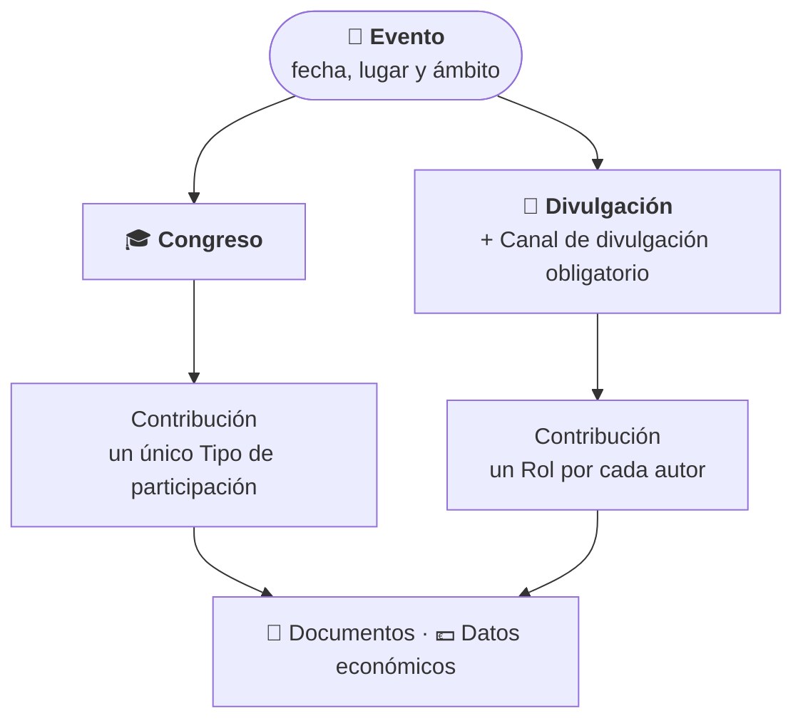
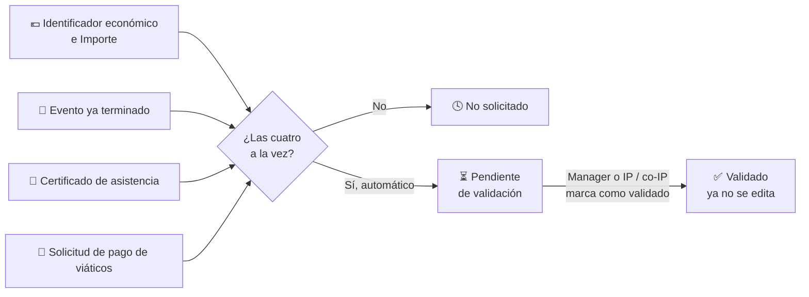

# Eventos y Contribuciones

El módulo **Eventos** registra la actividad de difusión del grupo. Se organiza en dos niveles:

- **Evento:** el acto en sí, con su fecha y lugar. Puede ser un **Congreso** o una actividad de **Divulgación** (feria de ciencias, charla en un instituto, entrevista en radio…).
- **Contribución:** la participación concreta de una o varias personas del grupo en ese evento (una comunicación oral, un póster, una charla, una entrevista…). Un evento puede tener muchas contribuciones.

El **tipo del evento decide cómo se rellenan sus contribuciones**, como se explica más abajo.

## 🗓️ Listado, calendario y filtros \{#listado-calendario-y-filtros}

Accede desde **Investigación → Eventos**. En la parte superior, un **calendario de tres meses** marca con un punto los días en que hay eventos; pulsa un día para ver solo los eventos que se celebran en esa fecha (los de varios días incluidos) y vuelve a pulsarlo, o usa **Quitar día**, para volver al listado completo.

La tabla muestra el **Tipo**, el **Título**, la **Ubicación**, la **Fecha de inicio**, el **Ámbito** (Nacional o Internacional) y el **Nº de contribuciones** de cada evento, ordenados del más reciente al más antiguo. Pulsa sobre una fila para abrir el evento.

*Calendario y listado de eventos del grupo.*

- **Búsqueda rápida:** el cuadro superior busca por **título o ubicación**. Al abrirlo muestra los últimos registros.
- **Paginación:** al pie de la tabla eliges cuántas filas ver por página.

### Filtros avanzados

El botón de filtros despliega un panel con ocho selectores: **Tipo**, **Autores**, **Proyectos asociados**, **Canal de divulgación**, **Rol**, **Año**, **País** y **Ciudad** (esta última se activa al elegir un país). Pulsa **Aplicar filtros** para confirmarlos o **Limpiar filtros** para quitarlos; el botón de filtros muestra cuántos hay activos.

*Panel de filtros abierto sobre el listado.*

## 📄 Consultar un evento y sus contribuciones \{#consultar-un-evento-y-sus-contribuciones}

La ficha del evento muestra su tipo, ámbito, ubicación, fechas y número de contribuciones. Debajo, una tabla lista las **contribuciones** con sus **autores**, el **tipo** de participación y el **proyecto que financia la dieta**. Pulsa una contribución para ver su detalle completo.

*Ficha de un congreso con dos contribuciones.*

El menú de tres puntos de la ficha ofrece **Editar evento**, **Añadir contribución** y **Eliminar evento**; las opciones que no puedes usar aparecen deshabilitadas.

## 🔐 Permisos requeridos \{#permisos-requeridos}

:::info[🔐 Permisos requeridos]

Consulta qué es cada rol en [Modelo de Roles y Accesos](../01-getting-started/02-roles-and-access.md).

| Acción | Quién puede |
|---|---|
| Consultar eventos y contribuciones | Cualquier usuario del grupo |
| **Nuevo evento** | **Reviewer** y **Manager** |
| **Editar evento** | Quien lo creó y **Manager** |
| **Eliminar evento** (y sus contribuciones) | Solo **Manager** |
| **Añadir contribución** | **Contributor**, **Reviewer** y **Manager** |
| **Editar contribución** | **Reviewer** y **Manager**; un **Contributor** solo la suya (si la creó o figura entre sus autores) |
| **Eliminar contribución** | Solo **Manager** |
| Marcar como revisados los avisos de importación | **Reviewer** y **Manager** |
| Validar los datos económicos | **Manager** y el IP o co-IP del proyecto que financia la dieta |

Un **Reviewer** puede crear eventos, pero solo editar los que creó él mismo; sí puede editar cualquier contribución. Si no tienes permiso, el botón no aparece o está deshabilitado.

:::

## ➕ Crear un evento \{#crear-un-evento}

Pulsa **Nuevo evento** en el listado (solo visible si tienes permiso). Todos los campos son obligatorios:

1. **Título** del evento.
2. **Tipo:** **Congreso** o **Divulgación**.
3. **Ámbito:** **Nacional** o **Internacional**.
4. **País** y **Ciudad.** El país viene preseleccionado como España; la ciudad se elige entre las del país.
5. **Fecha de inicio** y **Fecha de fin.**

**Guardar** se habilita cuando el formulario está completo y te lleva a la ficha del evento.

*Formulario de nuevo evento con el país preseleccionado.*

:::warning[El Canal de divulgación depende del tipo]

Al elegir el tipo **Divulgación** aparece el campo **Canal de divulgación** (redes sociales, prensa escrita, radio, televisión, pódcast, feria de ciencias, actividad escolar o universitaria, evento público, taller, exposición, café científico o charla divulgativa), y pasa a ser **obligatorio**. Si cambias el tipo a **Congreso**, el canal se borra, porque un congreso no puede tener canal.

Además, la **Fecha de fin** no puede ser anterior a la **Fecha de inicio**.

:::

*Al elegir Divulgación aparece el Canal de divulgación.*

## ➕ Añadir una contribución \{#añadir-una-contribución}

Desde la ficha del evento, abre el menú de tres puntos y pulsa **Añadir contribución**. El formulario se adapta al tipo del evento:

| Campo | Congreso | Divulgación |
|---|---|---|
| **Título** | Obligatorio | Obligatorio |
| **Tipo de participación** | Obligatorio (una sola para toda la contribución) | No aparece |
| **Rol** de cada autor | No aparece | Obligatorio para cada autor |
| **Autores** | Al menos uno | Al menos uno |
| **Proyectos asociados** | Obligatorio al crear | Obligatorio al crear |
| **Proyecto que financia la dieta** | Obligatorio al crear | Obligatorio al crear |
| **Agradecimientos**, **Enlaces externos** | Opcionales | Opcionales |

Los tipos de participación de un congreso son **Conferencia invitada**, **Comunicación oral**, **Póster** y **Asistencia**. Los roles de una actividad de divulgación son, entre otros, **Ponente**, **Entrevistado/a**, **Moderador/a**, **Organizador/a**, **Divulgador/a científico/a** o **Participante**.

*Contribución a un congreso: se pide un único Tipo de participación.*

### Autores

Busca a cada persona por su nombre en **Autores**. La lista resultante está **ordenada**: quien ocupa la primera posición (subrayada) figura como **Presentador/a** en un congreso, o como **Primer autor/a** en una actividad de divulgación salvo que su rol implique dirigirse a un público. Usa las flechas para reordenar y la cruz para quitar a alguien.

*En divulgación, cada autor lleva su propio Rol.*

:::warning[Proyecto que financia la dieta]

El **Proyecto que financia la dieta** solo ofrece los proyectos que hayas elegido en **Proyectos asociados**. Si quitas de esa lista el proyecto que estaba seleccionado como financiador, el campo se vacía y debes elegir otro.

:::

### Documentos

Los documentos (PDF, JPG o PNG, **máximo 10**) no se pueden adjuntar al crear la contribución: **guárdala primero** y súbelos desde su ficha o al editarla.

## 💶 Datos económicos de una contribución \{#datos-económicos-de-una-contribución}

La ficha de cada contribución incluye un panel **Datos económicos** con el **Identificador económico** y el **Importe**, y un estado:

| Estado | Significado |
|---|---|
| **No solicitado** | Aún no se han introducido los datos o no se cumplen las condiciones |
| **Pendiente de validación** | Se cumplen todas las condiciones y se avisa a quien debe validar |
| **Validado** | Un responsable ha confirmado los datos; ya no se pueden editar |

*Ficha de una contribución con el panel Datos económicos en estado No solicitado.*

**Del registro a la validación económica:**

:::info[Cuándo pasa a Pendiente de validación]

El paso es **automático** cuando se cumplen a la vez las cuatro condiciones:

- Hay **Identificador económico** y **Importe**.
- El evento **ya ha terminado** (su fecha de fin es hoy o anterior).
- Hay al menos un documento clasificado como **Certificado de asistencia**.
- Hay al menos un documento clasificado como **Solicitud de pago de viáticos**.

Clasifica cada documento adjunto en el propio panel (**Certificado de asistencia**, **Solicitud de pago de viáticos** u **Otro**).

:::

Cuando el estado es **Pendiente de validación**, el **Manager** o el IP o co-IP del proyecto que financia la dieta ve el botón **Marcar como validado** y debe confirmar la acción. Una contribución sin proyecto financiador solo la puede validar un Manager.

## ⚠️ Avisos de importación \{#avisos-de-importación}

Los eventos y contribuciones cargados desde un CSV pueden llevar la nota **Notas de importación — pendiente de revisión** con los datos que faltaban. Un **Reviewer** o **Manager** corrige los datos y pulsa **Marcar como revisado** para descartar el aviso.

:::tip[Registra los eventos al terminar la actividad]

Crea el evento y sus contribuciones en cuanto se celebre y sube enseguida el certificado de asistencia y la solicitud de viáticos: así la contribución pasa a **Pendiente de validación** sin más trámites.

:::
