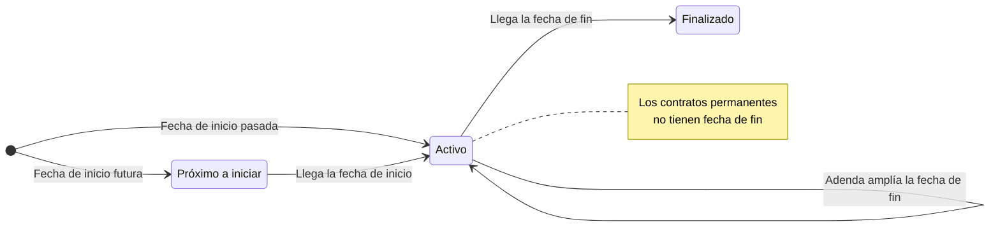
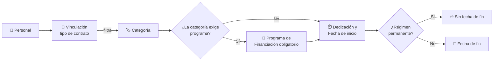

# Vinculación con el Equipo

El módulo **Vinculación con el Equipo** registra la relación contractual de cada persona con el grupo: su categoría profesional (por ejemplo, *Estudiante Predoctoral* o *Catedrático de Universidad*), el tipo de vinculación, la dedicación, las fechas y, si procede, la entidad financiadora y el proyecto asociado. Cada registro es un **contrato** y una persona puede tener varios a lo largo del tiempo.

## 🔎 Listado, búsqueda y filtros \{#listado-búsqueda-y-filtros}

Accede desde **Equipo → Vinculación con el Equipo**. La tabla muestra, para cada contrato:

- **Personal:** nombre de la persona.
- **Categoría:** categoría profesional y, debajo, la entidad financiadora (si la hay).
- **Fechas:** inicio y fin. Los contratos permanentes muestran *Sin fecha de fin (permanente)*.
- **Estado:** **Activo**, **Próximo a Iniciar** o **Finalizado**, calculado a partir de las fechas de hoy.

*Listado de contratos del grupo.*

- **Búsqueda rápida:** el cuadro superior filtra por el **nombre** de la persona mientras escribes.
- **Paginación:** al pie eliges cuántas filas ver por página.
- **Abrir un contrato:** pulsa sobre la fila para ver su ficha. El menú de tres puntos de la columna **Acciones** ofrece **Editar**, **Añadir Adenda** y **Eliminar**.

### Filtros avanzados

El botón de filtros despliega un panel con tres selectores de selección múltiple:

- **Régimen laboral:** Profesorado Permanente, Personal Permanente, Vinculación Temporal, Beca de Formación y Matriculación.
- **Dedicación:** Tiempo Completo o Tiempo Parcial.
- **Proyecto:** se busca por código o título.

Pulsa **Aplicar filtros** para confirmarlos y **Limpiar filtros** para eliminarlos. El botón de filtros muestra cuántos están activos.

*Panel de filtros abierto.*

## 📄 Consultar un contrato \{#consultar-un-contrato}

La ficha reúne el estado, el régimen y la dedicación, la persona, la categoría, el programa de financiación, la entidad financiadora, las fechas, el proyecto (con enlace a su ficha) y las notas. En los contratos con fecha de fin aparece además una barra de **Tiempo transcurrido**, que se resalta cuando se ha consumido el 90 % o más.

*Ficha de un contrato temporal con su barra de tiempo transcurrido.*

Si el contrato se ha ampliado con una adenda, la ficha muestra la **Fecha de Fin Efectiva** con la etiqueta *Ampliado por adenda*; la **Fecha de Fin** original no cambia.

**Estados de un contrato:**

## 🔐 Permisos requeridos \{#permisos-requeridos}

:::info[🔐 Permisos requeridos]

Consulta qué es cada rol en [Modelo de Roles y Accesos](../01-getting-started/02-roles-and-access.md).

| Acción | Quién puede |
|---|---|
| Acceder a esta pantalla desde la navegación | **Reviewer** y **Manager** |
| Ver los contratos | **Manager**: todos. Resto de roles: solo los que el servidor les permite (los propios o los de las personas que supervisan como investigador principal) |
| **Nueva Vinculación**, **Editar** y **Añadir Adenda** | **Manager** |
| **Eliminar** | Solo **Manager** |

Los botones de creación y edición aparecen también a los **Reviewers**, pero el servidor solo autoriza estas acciones a los **Managers**: un Reviewer que las intente recibirá un error de permisos.

:::

## ➕ Crear una vinculación \{#crear-una-vinculación}

Pulsa **Nueva Vinculación** (o, desde el perfil de una persona del equipo, la opción equivalente: en ese caso el campo **Personal** ya viene fijado).

*Formulario de nueva vinculación.*

1. Elige la persona en **Personal**.
2. Elige el tipo en **Vinculación**; esto determina qué **Categorías** puedes seleccionar.
3. Elige la **Categoría**. Si la categoría exige un programa de financiación, aparece el campo **Programa de Financiación**, que pasa a ser obligatorio.
4. Indica la **Dedicación** (*Tiempo Completo* por defecto) y la **Fecha de Inicio**.
5. Indica la **Fecha de Fin**, salvo en vinculaciones permanentes.
6. Opcionalmente, rellena **Entidad Financiadora**, **Proyecto** (solo proyectos activos) y **Notas**.
7. Pulsa **Guardar**.

**Cómo se encadenan los campos:**

:::warning[Reglas del formulario]

- **Obligatorios:** **Personal**, **Categoría** y **Fecha de Inicio**, más **Programa de Financiación** cuando la categoría lo requiere. Mientras falte alguno, **Guardar** permanece desactivado.
- **Las categorías dependen de la vinculación.** Al cambiar la **Vinculación** se vacían la **Categoría** y el **Programa de Financiación**.
- **Las vinculaciones permanentes no tienen fecha de fin.** El campo **Fecha de Fin** se desactiva y se vacía automáticamente, con el aviso «Los regímenes permanentes no tienen fecha de fin».

:::

*Con **Profesorado Permanente** la **Fecha de Fin** queda desactivada.*

## ✏️ Editar, ampliar con una adenda y eliminar \{#editar-ampliar-con-una-adenda-y-eliminar}

- **Editar:** abre el mismo formulario con los datos del contrato.
- **Añadir Adenda:** amplía un contrato sin modificar su fecha de fin original. Indica la **Fecha de Firma**, la **Nueva Fecha de Fin** y el **Motivo de la Adenda** (los tres obligatorios); la **Modificación Económica** (importe en EUR) es opcional. A partir de ese momento el contrato se considera vigente hasta la nueva fecha.
- **Eliminar:** pide confirmación. Un administrador puede revertir el borrado.

*Diálogo **Añadir Adenda**.*

:::tip[Registra las prórrogas como adenda]

Si un contrato temporal se prorroga, añade una adenda en lugar de editar la fecha de fin: así se conserva la fecha original y el motivo de la ampliación.

:::
