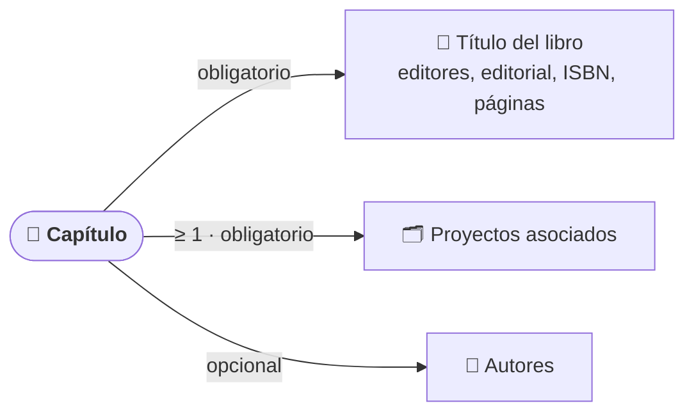

# Capítulos de Libro

El módulo **Capítulos de Libro** reúne los capítulos publicados por el grupo en obras colectivas. Cada capítulo indica el libro en el que aparece, sus editores, editorial, ISBN, año y páginas, y se vincula a los **proyectos** que lo financiaron y a sus **autores**.

## 🔎 Listado, búsqueda y filtros \{#listado-búsqueda-y-filtros}

Accede desde **Investigación → Capítulos de Libro**. La tabla muestra el **título del capítulo**, los **autores** (avatares con sus iniciales), el **título del libro** y el **año**.

*Listado de capítulos con el panel de filtros desplegado.*

- **Búsqueda rápida:** el cuadro superior filtra por **título** mientras escribes.
- **Paginación:** al pie de la tabla eliges cuántas filas ver por página (10, 25, 50 o 100).
- **Abrir un capítulo:** pulsa sobre la fila para ver su ficha, o usa el menú de tres puntos de la fila (**Editar** y **Eliminar**).

### Filtros avanzados

El botón de filtros (icono de controles) despliega un panel con dos criterios:

- **ISBN:** basta con escribir una parte del ISBN.
- **Proyectos:** selección múltiple; se buscan por código o título.

Pulsa **Aplicar filtros** para confirmarlos, **Cancelar** para cerrar el panel o **Limpiar filtros** para eliminarlos (también aparece junto al botón de filtros cuando hay una búsqueda o un filtro activo). El botón de filtros muestra cuántos criterios hay activos.

*Listado de capítulos de libro del grupo, sin filtros.*

## 📄 Consultar un capítulo \{#consultar-un-capítulo}

La ficha muestra el título, la descripción, los **autores** (los vinculados a personal del grupo aparecen resaltados), el **título del libro**, los **editores**, la **editorial**, el **ISBN**, el **año** y las **páginas**, además de los **proyectos asociados**, que enlazan con la ficha de cada proyecto. Solo se muestran los datos que están informados. Al final, el **Historial de cambios** registra quién creó o modificó el capítulo y cuándo.

*Ficha de un capítulo con su libro, editorial, ISBN, páginas y proyecto asociado.*

## ➕ Añadir un capítulo \{#añadir-un-capítulo}

:::info[🔐 Permisos requeridos]

Consulta qué es cada rol en [Modelo de Roles y Accesos](../01-getting-started/02-roles-and-access.md).

| Acción | Quién puede |
|---|---|
| Consultar el listado y las fichas | Cualquier usuario del grupo |
| **Nuevo Capítulo de Libro** | **Contributor**, **Reviewer** y **Manager** |
| **Editar** un capítulo | **Manager**, quien lo creó y quienes figuran como autores vinculados a su usuario |
| **Eliminar** un capítulo | Solo **Manager** |

Si no tienes permiso, la opción aparece desactivada en el menú de tres puntos.

:::

Pulsa **Nuevo Capítulo de Libro**. El formulario tiene estos campos:

| Campo | Obligatorio | Notas |
|---|---|---|
| **Título del capítulo** | Sí | |
| **Proyectos asociados** | Sí | Se buscan por código, título o año; puedes añadir varios y quitarlos de la tabla de seleccionados. |
| **Autores** | No | Se añaden en orden escribiendo el nombre; pueden vincularse a personal del grupo. |
| **Título del libro** | Sí | |
| **Editores** | No | Texto libre. |
| **ISBN** | No | Es el valor que usa el filtro **ISBN**. |
| **Año** | No | Numérico. |
| **Editorial** | No | |
| **Páginas** | No | Por ejemplo `45-67`. |
| **Descripción** | No | Texto libre. |

*Formulario de alta: **Título del capítulo**, **Título del libro** y **Proyectos asociados** son obligatorios.*

Al pulsar **Crear Capítulo de Libro** se abre directamente la ficha del capítulo creado. **Cancelar** vuelve al listado sin guardar.

:::warning[Antes de guardar]

- Hasta que no selecciones al menos un proyecto, el formulario no se envía y no aparece ningún mensaje: revisa que **Proyectos asociados** tenga contenido.
- Si el servidor rechaza el alta, se muestra el motivo en un aviso rojo sobre los botones.

:::

## ✏️ Editar o eliminar \{#editar-o-eliminar}

Desde el menú de tres puntos de la fila o de la ficha, **Editar** abre el mismo formulario con los datos cargados. **Eliminar** solo está disponible para Managers y pide confirmación; el capítulo deja de aparecer en el listado.

:::tip[Cita siempre el libro completo]

Rellena **Título del libro**, **Editores**, **Editorial** y **Páginas**: son los datos que se necesitan para citar el capítulo en memorias e informes.

:::
