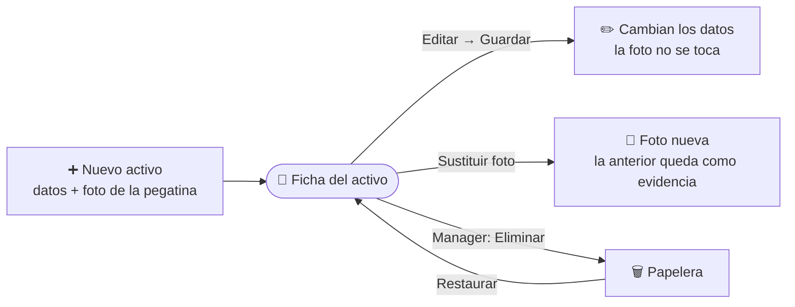

# Infraestructura e Inventario

El módulo **Infraestructura** es el inventario del equipamiento científico del grupo: microscopios, difractómetros, centrífugas y cualquier otro equipo adquirido con fondos de proyectos. Cada **activo** guarda su descripción, el importe de compra, la sala donde está, los proyectos que lo financiaron y una **foto de la pegatina de inventario** que sirve como evidencia en las auditorías.

## 🔎 Listado, búsqueda y filtros \{#listado-búsqueda-y-filtros}

Accede desde **Investigación → Infraestructura**. Todos los usuarios del grupo pueden consultar el inventario. Los activos se muestran como tarjetas con la foto de la pegatina, el nombre, la ubicación, el importe de compra y el número de proyectos que lo financian.

*Inventario del grupo: una tarjeta por activo. Pulsa una tarjeta para abrir su ficha.*

- **Búsqueda rápida:** el cuadro superior filtra por **nombre** mientras escribes.
- **Filtros avanzados:** el botón de filtros despliega un panel con **Ubicación**, **Proyectos financiadores**, **Importe mínimo** e **Importe máximo**. Se pueden combinar. Pulsa **Aplicar filtros** para confirmarlos; **Limpiar filtros** los elimina y **Cancelar** cierra el panel. Cuando hay filtros activos, el botón muestra cuántos son.
- **Paginación:** por defecto se muestran 24 activos por página; puedes cambiarlo con el selector **Por página**.

*Panel de filtros abierto: ubicación, proyectos financiadores y rango de importe.*

:::tip[Comparte una búsqueda filtrada]

Los filtros y la página se guardan en la dirección del navegador. Copia la URL para compartir con un compañero exactamente el mismo listado, por ejemplo «todo lo que debería estar en el Lab 2.14».

:::

En el filtro **Ubicación** solo se pueden elegir salas que ya existen; para registrar una sala nueva hay que hacerlo al crear o editar un activo.

## 📄 La ficha de un activo \{#la-ficha-de-un-activo}

Al pulsar una tarjeta se abre la ficha con la foto de la pegatina a tamaño completo, el nombre, la descripción, el importe de compra, la ubicación, los **Proyectos financiadores** (cada uno es un enlace a su proyecto) y quién lo registró.

*Ficha del activo. El menú de tres puntos (arriba a la derecha) ofrece **Editar** y **Eliminar** según tu rol.*

## 🔐 Permisos requeridos \{#permisos-requeridos}

:::info[🔐 Permisos requeridos]

Consulta qué es cada rol en [Modelo de Roles y Accesos](../01-getting-started/02-roles-and-access.md).

| Acción | User | Contributor | Reviewer | Manager |
|---|:---:|:---:|:---:|:---:|
| Consultar listado y fichas | Sí | Sí | Sí | Sí |
| Crear un activo (**Nuevo activo**) | No | Sí | Sí | Sí |
| Editar un activo **que registraste tú** | No | Sí | Sí | Sí |
| Editar **cualquier** activo | No | No | Sí | Sí |
| Sustituir la foto de la pegatina | No | Solo los suyos | Sí | Sí |
| Eliminar un activo | No | No | No | Sí |

Un **Contributor** solo puede modificar los activos que él mismo registró. Si intenta abrir la edición de otro, ve el mensaje «No tienes permiso para editar este activo». Eliminar es exclusivo del **Manager**, incluso para quien registró el activo: así el inventario sigue siendo auditable.

:::

**Ciclo de vida de un activo:**

## ➕ Registrar un nuevo activo \{#registrar-un-nuevo-activo}

Pulsa **Nuevo activo**, rellena el formulario y confirma con **Guardar**. Todos los campos son obligatorios.

*Formulario de alta. La foto de la pegatina (resaltada) es obligatoria y solo se puede aportar en este paso.*

1. **Nombre:** denominación oficial del equipo (máximo 255 caracteres).
2. **Descripción:** características técnicas, número de serie, etc.
3. **Importe de compra:** admite coma o punto decimal (`96500,00` o `96500.00`) y debe ser mayor o igual que cero. Se guarda con dos decimales.
4. **Ubicación:** busca la sala, laboratorio o despacho en el desplegable. Si no existe, escribe su nombre y elige **Crear «…»**. El sistema no distingue mayúsculas de minúsculas, así que «lab 2.14» se asocia a la sala «Lab 2.14» ya registrada en lugar de duplicarla.
5. **Proyectos financiadores:** busca y selecciona al menos un proyecto. El equipamiento cofinanciado puede tener varios. Al abrir el desplegable se muestran los 10 proyectos creados más recientemente.
6. **Foto de la pegatina de inventario:** arrastra una imagen o pulsa **Seleccionar imagen**. Formatos admitidos: JPG, PNG y WebP, con un límite de 50 MB.

:::warning[La foto es obligatoria y no se puede añadir después]

El activo y su foto se envían juntos al pulsar **Guardar**; no existe un paso intermedio para «guardar y subir la foto más tarde». Si falta algún campo, el formulario indica cuál antes de guardar:

- «El nombre es obligatorio.»
- «La descripción es obligatoria.»
- «La ubicación es obligatoria.»
- «Indica un importe válido mayor o igual que cero.»
- «Debes indicar al menos un proyecto financiador.»
- «La foto de la pegatina es obligatoria.»

:::

Al guardar, el sistema abre directamente la ficha del activo recién creado.

## ✏️ Editar un activo \{#editar-un-activo}

Desde la ficha, abre el menú de tres puntos y elige **Editar**. El formulario se carga con los datos actuales y se guarda con **Guardar**.

*Edición de un activo. El bloque inferior (resaltado) sustituye la foto de la pegatina de forma independiente.*

La foto se gestiona **por separado** de los datos:

- **Guardar** actualiza solo nombre, descripción, importe, ubicación y proyectos; nunca toca la foto.
- **Sustituir foto** (bloque inferior) se activa al elegir una imagen nueva con **Cambiar imagen**. Es una acción independiente del guardado.

:::warning[La foto anterior no se pierde]

Al sustituir la foto de la pegatina, la imagen anterior se conserva como evidencia de auditoría. Sustituir la foto no equivale a corregirla: úsalo cuando la pegatina física haya cambiado.

:::

## 🗑️ Eliminar un activo \{#eliminar-un-activo}

Solo el **Manager** ve la opción **Eliminar** en el menú de la ficha. Tras confirmar en el cuadro de diálogo, el activo deja de aparecer en el inventario y pasa a la **Papelera** (Administración → Papelera), desde donde un Manager puede restaurarlo.

## 🚧 Estados vacíos y errores \{#estados-vacíos-y-errores}

- **«Aún no hay equipamiento registrado.»** El grupo todavía no tiene activos. Quien tiene permiso de creación ve aquí el botón **Nuevo activo**.
- **«Ningún activo coincide con los filtros aplicados.»** Pulsa **Limpiar filtros** para volver al listado completo.
- **«No se ha podido cargar el inventario.»** Error de red o de servidor; usa **Reintentar**.
- **«No se ha encontrado este activo.»** La ficha no existe o fue eliminada; usa **Volver al inventario**.
- **«No se ha podido guardar. Revisa los datos e inténtalo de nuevo.»** El servidor rechazó el guardado; comprueba los campos y repite.
