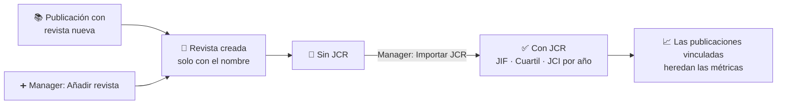

# Revistas

El módulo **Revistas** es el catálogo de consulta de las revistas científicas en las que publica el grupo. Para cada revista guarda sus datos de identificación (editorial, ISSN, categorías) y su **historial de citación**: el factor de impacto (**JIF**), el **cuartil** y el ranking **JCI** de cada año según el *Journal Citation Reports* (JCR).

Estos indicadores son los que ves en la ficha de cada [publicación](./02-publications.md): la publicación se vincula a una revista y hereda sus métricas.

:::note[Catálogo compartido]

Las revistas son datos de referencia globales: no pertenecen a un grupo concreto, así que todos los grupos ven el mismo catálogo.

:::

**De la revista nueva a las métricas en la publicación:**

## 🔎 Listado, búsqueda y filtros \{#listado-búsqueda-y-filtros}

Accede desde **Consulta → Revistas**. En la parte superior, dos tarjetas resumen el catálogo:

- **Revistas activas con JCR:** las que tienen al menos un año de métricas.
- **Revistas sin JCR:** las que aún no tienen ninguna. Pulsa sobre esta tarjeta para **filtrar la tabla** y ver solo esas revistas; vuelve a pulsarla para quitar el filtro.

Debajo, **Gestión de Revistas** muestra cuántas revistas están indexadas y la tabla con tres columnas: **Nombre de la revista** (enlace a su ficha), **Editorial** e **Historial de citación** (número de años con métricas). Puedes ordenar por cualquiera de ellas pulsando su cabecera; al pie eliges las filas por página.

*Catálogo de revistas con las tarjetas de resumen JCR (vista de Manager).*

- **Búsqueda rápida:** el cuadro **Buscar revistas…** filtra por nombre mientras escribes.
- **Filtros avanzados:** el botón de filtros despliega el panel **Filtrar por** con dos selectores de selección múltiple, **Revista** y **Editorial** (las editoriales son las que existen realmente en el catálogo). Pulsa **Aplicar filtros** para confirmarlos, **Cancelar** para descartarlos o **Limpiar filtros** para quitarlos todos.

*Panel de filtros abierto: selectores de Revista y Editorial.*

## 📄 Consultar una revista \{#consultar-una-revista}

Pulsa el nombre de una revista para abrir su ficha. Muestra la **abreviatura JCR**, la **editorial**, el **ISSN** y el **eISSN**, la **edición** (por ejemplo SCIE) y las **categorías** temáticas. A la derecha del título aparece el cuartil del año más reciente que tenga cuartil asignado.

Si la revista tiene métricas, la sección **Historial de citación** las lista por año, de más reciente a más antiguo: **JIF**, **Cuartil JIF** (Q1 a Q4, con color) y **Ranking JCI**.

*Ficha de una revista con sus datos y su historial de citación.*

## 🔐 Permisos requeridos \{#permisos-requeridos}

:::info[🔐 Permisos requeridos]

Consulta qué es cada rol en [Modelo de Roles y Accesos](../01-getting-started/02-roles-and-access.md).

| Acción | Quién puede |
|---|---|
| Ver el listado y las fichas | Contributor, Reviewer y Manager |
| Añadir, editar, eliminar o importar métricas JCR | Solo Manager |

:::

Un usuario con rol **User** no ve la entrada **Revistas** en el menú ni puede abrir la página. Los botones de gestión solo aparecen a los Manager.

## 🛠️ Gestionar el catálogo (Manager) \{#gestionar-el-catálogo-manager}

### Añadir una revista

1. Pulsa **Añadir revista**. Se abre una fila editable al principio de la tabla.
2. Escribe el **nombre de la revista** y pulsa **Guardar** (o la **X** para cancelar).

*Alta rápida: solo se pide el nombre.*

El alta crea la revista únicamente con su nombre. Para completar la editorial, el ISSN o las categorías, abre el menú de tres puntos de su fila (o de su ficha) y elige **Editar**.

### Editar y eliminar

El menú de tres puntos de cada fila y de la ficha ofrece **Editar** y **Eliminar**.

:::warning[Eliminar una revista]

La eliminación **no se puede deshacer** y puede afectar a las publicaciones vinculadas a esa revista. La aplicación pide confirmación antes de borrar.

:::

### Importar métricas JCR

El botón **Importar JCR** abre la pantalla de importación de métricas, con la que se cargan o actualizan los datos de citación de las revistas. Es la forma habitual de que una revista pase de **sin JCR** a **con JCR**.

:::tip[Revistas sin JCR]

Si una publicación muestra «Sin métricas JCR disponibles aún», comprueba en este módulo si su revista figura en **Revistas sin JCR** y avisa a un Manager para que importe los datos del año.

:::
