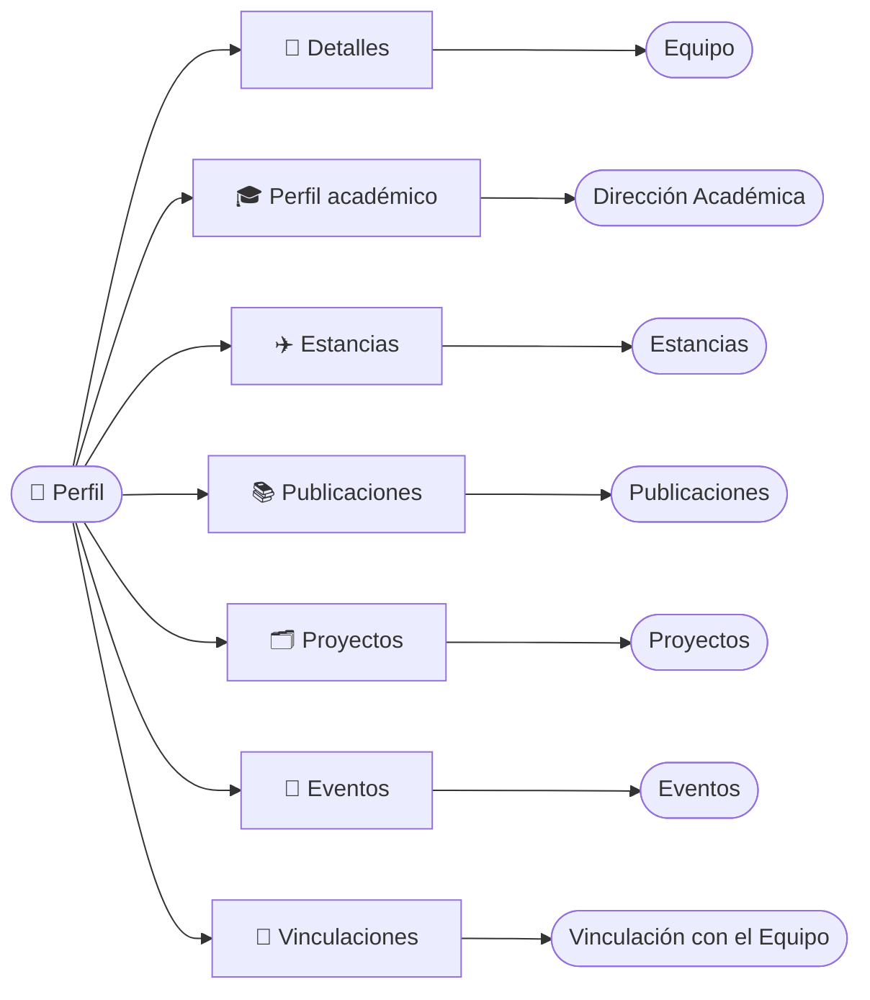

# Perfil de una Persona

La ficha de cada miembro del equipo es su **perfil**: un único lugar donde se ven todas sus contribuciones al grupo. Desde ella consultas sus publicaciones, los proyectos en los que participa, sus eventos y divulgación, su formación, sus estancias y sus contratos, sin recorrer cada módulo por separado.

Se llega desde **Equipo → Equipo** pulsando sobre el nombre de la persona. La dirección tiene la forma `/<grupo>/teams/<nombre-apellido>`; por ejemplo, `/nanotech-lab/teams/carlos-garcia`.

:::note[Un enlace estable por persona]

El nombre en la dirección es un identificador legible (*slug*). Los enlaces antiguos con un código largo siguen funcionando, pero el navegador los sustituye por el enlace corto. Cada pestaña tiene además su propia dirección, así que puedes copiarla, enviarla o recargarla sin perder el sitio.

:::

## 🧱 Estructura del perfil \{#estructura-del-perfil}

Bajo el nombre y la ruta de navegación aparece una barra con el avatar de la persona y siete pestañas.

| Pestaña | Qué contiene | Dirección |
|---|---|---|
| **Detalles** | Datos personales e identificadores. | `/teams/carlos-garcia` |
| **Perfil académico** | Titulaciones y tesis. | `…/academic-profile` |
| **Estancias** | Estancias de investigación. | `…/stays` |
| **Publicaciones** | Artículos en los que figura como autor. | `…/publications` |
| **Proyectos** | Proyectos en los que participa. | `…/projects` |
| **Eventos** | Contribuciones a congresos y actividades de divulgación. | `…/events` |
| **Vinculaciones** | Contratos con el grupo. | `…/employment-records` |

Si escribes una sección que no existe, se muestra **Detalles**.

**Cada pestaña reúne datos de un módulo:**

## 🧾 Detalles \{#detalles}

Reúne los datos de contacto y los identificadores científicos de la persona: **Nombre**, **Apellidos**, **Segundo apellido**, **Correo electrónico**, **ORCID**, **ResearcherID (WOS)**, **Director / supervisor**, **Sexenios** y **Sexenios de transferencia**. El ORCID y el ResearcherID son enlaces a sus perfiles públicos.

*Pestaña **Detalles** vista por un usuario sin rol de revisión: no se muestran nacionalidad, DNI ni fecha de nacimiento.*

:::warning[Datos personales protegidos]

**Nacionalidad**, **DNI / Identificación** y **Fecha de nacimiento** solo los ven los **Reviewer**, los **Manager** y la propia persona. Para el resto no aparecen y tampoco se indica si están rellenados.

:::

Si la persona aún no tiene perfil académico, no se muestran los identificadores ni los sexenios y aparece un aviso en su lugar.

## 📚 Publicaciones \{#publicaciones}

Es el mismo explorador del módulo [Publicaciones](./02-publications.md), limitado a esta persona: con su cuadro de búsqueda, el panel de filtros, la tabla (**DOI**, **Título**, **Año**, **Revista** y **Fecha de creación**) y la paginación. Un candado verde indica acceso abierto.

*Pestaña **Publicaciones**: tres artículos de la persona, con su revista y año.*

Se buscan por la **persona**, no por un nombre concreto: si firma con variantes de su nombre, se muestran todas sus publicaciones. Desde aquí no se pueden crear publicaciones; para ello usa el módulo de Publicaciones.

## 🗂️ Proyectos \{#proyectos}

Lista los proyectos en los que la persona tiene una participación activa, ya sea como **IP**, como miembro del **equipo de investigación** o del **equipo de trabajo**. Es la misma tabla que el módulo [Proyectos](./01-projects.md): **Código**, **Título y entidad** (con su estado), **IP**, **Importe** y **Avance**, con el menú de tres puntos de cada fila.

*Pestaña **Proyectos**: se incluyen los proyectos finalizados y los activos.*

La columna **IP** muestra las iniciales de los investigadores principales del proyecto, no las de la persona del perfil.

## 🎤 Eventos \{#eventos}

Recoge todas sus contribuciones a congresos y actividades de divulgación, con independencia del evento. Para cada una se ve el **Congreso o evento** (tipo, ámbito, fechas y lugar), la **Contribución**, los **Autores**, el **Tipo** de participación y el **Proyecto que financia la dieta**. Pulsa una fila para abrir la contribución. Más información en [Eventos y Divulgación](./05-events.md).

*Pestaña **Eventos**: una ponencia invitada en un congreso y una mesa redonda de divulgación.*

Si la persona no tiene contribuciones, se muestra «Este usuario no tiene contribuciones registradas».

## 🎓 Perfil académico y Estancias \{#perfil-académico-y-estancias}

Ambas pestañas son tablas de solo lectura sobre una persona ajena:

- **Perfil académico:** **Título de la titulación**, **Universidad o institución**, **Fechas** y **Estado**. Pulsa una fila para ver el detalle de la titulación sin salir del perfil. Ver [Dirección Académica](./03-academic-direction.md).
- **Estancias:** **Institución de acogida**, **País**, **Tipo de estancia**, **Fechas** y **Duración (meses)**. Ver [Movilidad](./04-mobility.md).

Si todavía no hay registros, verás «Todavía no se han registrado estudios» o «Todavía no se han registrado estancias».

## 📑 Vinculaciones \{#vinculaciones}

Muestra los contratos de la persona con el grupo: **Categoría** (con régimen y dedicación), **Fechas** y **Estado** (**Activo** o **Finalizado**). Ver [Vinculaciones](./06-employment-records.md).

*Pestaña **Vinculaciones** vista por un Manager, con el menú de tres puntos para añadir una nueva.*

:::info[🔐 Permisos requeridos]

Consulta qué es cada rol en [Modelo de Roles y Accesos](../01-getting-started/02-roles-and-access.md).

| Acción | Quién puede |
|---|---|
| Ver **Detalles**, **Perfil académico**, **Estancias**, **Publicaciones**, **Proyectos** y **Eventos** | Cualquier usuario del grupo |
| Ver **Nacionalidad**, **DNI** y **Fecha de nacimiento** | **Reviewer**, **Manager** y la propia persona |
| Ver las **Vinculaciones** de una persona | **Manager**, la propia persona y el **IP** que la supervisa actualmente |
| Añadir o editar una **Vinculación** | Solo **Manager** |
| **Editar perfil** de otra persona | Solo **Manager** |
| Añadir titulaciones o estancias | La propia persona (un **Manager** también puede añadir estancias a otros) |
| Cambiar el avatar | Solo la propia persona, desde su avatar |

Si no tienes permiso, la acción no aparece. En el perfil de otra persona sin acciones disponibles no se muestra el menú de tres puntos.

:::

:::warning[Las Vinculaciones no son públicas]

Un **Reviewer** que no sea IP de la persona **no ve** sus contratos aunque la pestaña aparezca en la barra. Es una restricción de la API, no un error de carga.

:::

## 🙋 Tu propio perfil \{#tu-propio-perfil}

Tu perfil es el de cualquier otra persona, con dos diferencias: puedes cambiar tu avatar pulsando sobre él y puedes añadir tus propias titulaciones y estancias desde el menú de tres puntos de la pestaña correspondiente.

:::tip[Prepara tu CV o una memoria]

Las pestañas **Publicaciones**, **Proyectos** y **Eventos** reúnen en una sola vista toda la producción de una persona, lo que ahorra consultar cada módulo con filtros al preparar un currículum o una justificación.

:::

Para editar los datos del perfil y gestionar el directorio, consulta [Equipo](./06-team.md).
