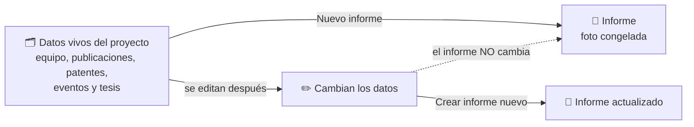
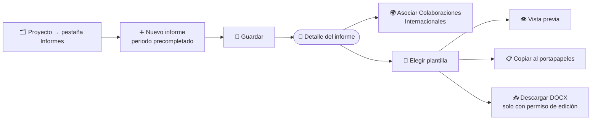

# Memorias de Proyectos

Cada proyecto tiene su propio registro de **informes de justificación**: documentos que recogen, para un periodo concreto, los datos del proyecto, su equipo, las publicaciones, patentes, eventos y tesis vinculados, con el formato que suelen pedir las entidades financiadoras para justificar una ayuda.

Cada informe es una **fotografía congelada** de los datos en el momento de crearlo: si después editas el proyecto o una publicación, el informe ya creado no cambia. Para reflejar los cambios, crea un informe nuevo.

Si buscas un informe que abarque a todo el grupo, consulta [Informes del Grupo](./02-group-reports.md).

**Por qué un informe no cambia solo:**

## 🔎 Listado de informes de un proyecto \{#listado-de-informes-de-un-proyecto}

Accede desde **Investigación → Proyectos**: abre un proyecto y pulsa la pestaña **Informes**. La tabla muestra, de cada informe, el **Periodo** que cubre, las **Notas**, quién lo creó (**Creado por**) y la **Última modificación**.

*Listado de informes de un proyecto, visto por un Reviewer. El botón **Nuevo informe** solo aparece si tienes permiso para crearlos.*

Pulsa el periodo de una fila para abrir el informe. Si el proyecto aún no tiene informes, el listado lo indica con «Todavía no hay informes de justificación».

:::info[🔐 Permisos requeridos]

Consulta qué es cada rol en [Modelo de Roles y Accesos](../01-getting-started/02-roles-and-access.md).

| Acción | User | Contributor | Reviewer | Manager | IP / co-IP del proyecto |
|---|:---:|:---:|:---:|:---:|:---:|
| Ver el listado y el detalle | Sí | Sí | Sí | Sí | Sí |
| Vista previa y copiar al portapapeles | Sí | Sí | Sí | Sí | Sí |
| **Nuevo informe** y descargar **DOCX** | No | No | Sí | Sí | Sí |
| Asociar **Colaboraciones Internacionales** | No | No | Sí | Sí | Sí |
| **Eliminar** un informe | No | No | No | Sí | No |

Los permisos se aplican siempre dentro de tu propio grupo. Los **investigadores principales (IP) y co-IP** de un proyecto pueden gestionar los informes de **su** proyecto aunque su rol base sea Contributor o User.

:::

:::warning[El botón Eliminar puede aparecer sin permiso real]

La pantalla muestra **Eliminar** a quien puede editar el informe (Reviewer, Manager e IP/co-IP), pero el servidor solo acepta el borrado de un **Manager**. Si otro perfil lo intenta, la operación falla. Pide al Manager que elimine el informe.

:::

## 👁️ Vista de solo lectura \{#vista-de-solo-lectura}

Un usuario sin permiso de edición (por ejemplo, un **Contributor** que no es IP del proyecto) ve el mismo listado y el mismo detalle, pero **sin el botón Nuevo informe** y sin los controles de edición.

*El Contributor puede consultar los informes, pero no crearlos.*

## ➕ Crear un informe \{#crear-un-informe}

Pulsa **Nuevo informe** en la pestaña **Informes** del proyecto.

*Formulario de nuevo informe. Las fechas del periodo (resaltadas) se precompletan con las del proyecto.*

1. **Inicio del periodo** y **Fin del periodo**. Se rellenan automáticamente con la fecha de inicio y de fin del proyecto; puedes cambiarlas para justificar solo un tramo (por ejemplo, una anualidad).
2. **Notas** (opcional): un comentario libre que aparece en el listado.
3. Pulsa **Guardar**. Pasas directamente al detalle del informe. **Cancelar** vuelve al listado sin guardar.

:::warning[Coherencia de las fechas]

La fecha de fin no puede ser anterior a la de inicio: el formulario te lo indica y no deja guardar. Si dejas una fecha en blanco, se usa la del proyecto.

:::

El proyecto ya viene fijado por la pestaña desde la que creas el informe; no hay que elegirlo.

**Del proyecto al documento Word:**

## 📄 Detalle de un informe \{#detalle-de-un-informe}

El detalle se organiza, de arriba abajo, en estos bloques:

*Detalle de un informe: datos del proyecto, colaboraciones, secciones desplegables y exportación.*

1. **Cabecera:** periodo, notas y, si puedes editar, el botón **Eliminar**.
2. **Datos del proyecto:** modalidad, área y subárea, prioridad temática, IP1 e IP2 con su ORCID, entidad beneficiaria, centro, fechas, duración y total concedido. Los campos sin dato aparecen con «—». Se completan en la sección *Datos para informes de justificación* del [formulario de proyecto](../02-core-features/01-projects.md).
3. **Colaboraciones Internacionales:** lista de publicaciones asociadas a este informe. Quien puede editar busca por **título o DOI** y pulsa **Asociar**; el resto solo ve las ya asociadas. Las colaboraciones no se vinculan al proyecto, solo al informe.
4. **Secciones desplegables:** **Modificaciones**, **Equipo de Investigación**, **Equipo de Trabajo**, **Formación y Movilidad**, **Publicaciones**, **Patentes**, **Eventos**, **Tesis Doctorales** y **Otras Publicaciones**. Cada una muestra «Sin datos para este apartado» si no hay nada que recoger.
5. **Exportación**, descrita a continuación.

:::note[Informes antiguos]

Un informe creado antes de existir la fotografía de datos muestra el aviso «Este informe no dispone de una foto fija de datos». En ese caso crea un informe nuevo.

:::

## 📤 Exportar el informe \{#exportar-el-informe}

El bloque **Exportación** está disponible para todos los roles que pueden ver el informe, salvo **Descargar DOCX**, que exige permiso de edición.

*Bloque de exportación del informe.*

- **Selector de plantilla:** **Diseño estándar** (el formato por defecto con las secciones de la memoria), las plantillas base del sistema y las de tu grupo. La elección se aplica a la vista previa, a la copia y a la descarga.
- **Vista previa / Ocultar vista previa:** muestra el documento tal y como se exportará.
- **Copiar al portapapeles:** copia el informe como texto para pegarlo en otro editor. Si el navegador bloquea el acceso al portapapeles, no se copia nada.
- **Descargar DOCX:** descarga el informe como documento Word (`informe-<código del proyecto>.docx`).

:::tip[Una plantilla por convocatoria]

Si la entidad financiadora exige otro formato de memoria, crea una plantilla distinta en **Administración → Plantillas de informes** y selecciónala al exportar. Puedes cambiar de plantilla tantas veces como quieras sobre el mismo informe. Más detalles en [Informes del Grupo](./02-group-reports.md#exportar-el-informe).

:::

## 🗑️ Eliminar un informe \{#eliminar-un-informe}

Solo el rol **Manager** puede eliminar un informe, con el botón **Eliminar** del detalle y confirmando en el diálogo.

:::warning[La eliminación es definitiva]

Al eliminar un informe se pierden también las **Colaboraciones Internacionales** asociadas. Si lo necesitas de nuevo, tendrás que crearlo otra vez y reflejará el estado actual del proyecto, no el del momento original.

:::
