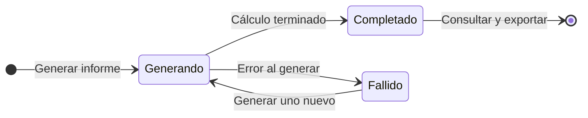
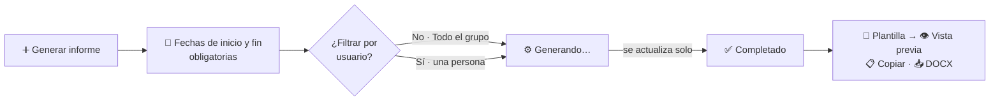

# Informes del Grupo

El módulo **Informes del grupo** consolida en un único documento toda la actividad del grupo durante un periodo: equipo, proyectos, publicaciones, eventos, patentes, capítulos de libro, trabajos académicos, tesis doctorales y estancias. Es la base para preparar memorias y justificaciones del grupo completo.

Cada informe es una **fotografía congelada** de los datos en el momento de generarlo: si después se edita un proyecto o una publicación, el informe ya generado no cambia. Para reflejar los cambios hay que generar un informe nuevo.

:::info[🔐 Permisos requeridos]

Lo que puedes hacer depende de tu rol:

| Acción | User | Contributor | Reviewer | Manager |
|---|---|---|---|---|
| Ver la opción **Informes del grupo** en el menú | No | Sí | Sí | Sí |
| Consultar el listado y el detalle de un informe | Solo por enlace directo | Sí | Sí | Sí |
| Elegir plantilla, previsualizar, copiar y descargar DOCX | Solo por enlace directo | Sí | Sí | Sí |
| **Generar informe** | No | No | Sí | Sí |
| **Eliminar** un informe | No | No | No | Sí |

Los informes consolidan los datos de **todos** los miembros, por eso solo los generan Reviewer y Manager. Los permisos se aplican siempre dentro de tu propio grupo.

:::

## 🔎 Listado de informes \{#listado-de-informes}

Accede desde **Investigación → Informes del grupo**. La tabla muestra, del más reciente al más antiguo, el **Periodo** cubierto (con el filtro de usuario aplicado), quién lo generó, cuándo y su **Estado**.

*Listado de informes con el botón **Generar informe**, visible para Reviewer y Manager.*

### Estados de un informe

| Estado | Significado |
|---|---|
| **Generando…** | El informe se está calculando en segundo plano. Puede tardar unos segundos. |
| **Completado** | El informe está listo para consultar y exportar. |
| **Fallido** | No se pudo generar. El detalle muestra el motivo; genera uno nuevo. |

**Ciclo de un informe:**

### Búsqueda y filtros

El botón de filtros despliega un panel con filtros combinables. Pulsa **Aplicar** para confirmarlos y **Limpiar filtros** para quitarlos. Los filtros quedan en la dirección de la página, así que puedes compartir el enlace.

*Panel de filtros abierto.*

- **Periodo del informe:** rango de fechas del periodo que cubre el informe.
- **Fecha de generación:** rango de fechas en que se generó.
- **Generado por:** la persona que lo generó.

## 👁️ Vista de solo lectura (Contributor) \{#vista-de-solo-lectura-contributor}

Un **Contributor** ve el mismo listado, pero **sin el botón Generar informe**. Desde el menú de cada fila (**Acciones**) solo dispone de **Ver**.

*El Contributor puede consultar y descargar informes, pero no crearlos ni eliminarlos.*

:::note[Rol User]

La opción **Informes del grupo** no aparece en el menú del rol **User**. La pantalla no tiene una restricción propia, por lo que quien conozca el enlace de un informe de su grupo podría abrirlo. Si necesitas que un usuario acceda de forma habitual, súbele a **Contributor**.

:::

## ➕ Generar un informe \{#generar-un-informe}

:::info[🔐 Permisos requeridos]

Generar informes está disponible para los roles **Reviewer** y **Manager**. Para el resto, el botón **Generar informe** no aparece y la pantalla de creación no se puede abrir.

:::

Pulsa **Generar informe** y completa el formulario:

*Formulario de generación con el periodo resaltado.*

1. **Fecha de inicio** y **Fecha de fin** del periodo. Son obligatorias, y la fecha de fin no puede ser anterior a la de inicio.
2. **Filtrar por usuario** (opcional). Por defecto, **Todo el grupo**. Si eliges una persona, el informe recoge solo su actividad.
3. Pulsa **Generar informe**.

Al enviar, pasas directamente al detalle del informe, que muestra **Generando…** y se actualiza solo cada pocos segundos hasta que aparece **Completado**. No hace falta recargar la página.

**Cómo se genera:**

:::warning[No recargues la página al generar]

Genera el informe navegando desde el menú. Si recargas el navegador estando en la pantalla **Generar informe** y envías el formulario, la generación puede fallar con un error técnico. Si te ocurre, vuelve al listado desde el menú e inténtalo de nuevo.

:::

## 📄 Detalle de un informe \{#detalle-de-un-informe}

Pulsa el periodo de una fila para abrir el informe. Arriba aparece el **Resumen** con los totales (miembros del equipo, proyectos totales y activos, presupuesto total, publicaciones, eventos, patentes, capítulos de libro, trabajos académicos y estancias).

Debajo, nueve secciones desplegables con el detalle:

1. Miembros del equipo
2. Proyectos
3. Publicaciones
4. Eventos
5. Patentes
6. Capítulos de libro
7. Trabajos académicos
8. Tesis Doctorales y Trabajos Académicos
9. Estancias de investigación

*Detalle de un informe **Completado**: resumen y secciones desplegables.*

## 📤 Exportar el informe \{#exportar-el-informe}

El bloque **Exportación** del detalle está disponible para **Contributor, Reviewer y Manager**.

*Bloque de exportación con la **Vista previa** abierta.*

- **Selector de plantilla:** **Diseño estándar** (el formato por defecto), las plantillas base del sistema y las plantillas de tu grupo. La elección se aplica a la vista previa, a la copia y a la descarga.
- **Vista previa / Ocultar vista previa:** muestra el documento tal y como se exportará.
- **Copiar al portapapeles:** copia el informe con formato para pegarlo en Word u otro editor. Si el navegador bloquea el acceso al portapapeles, no se copia nada.
- **Descargar DOCX:** descarga el informe como documento Word.

:::tip[Adapta el informe a cada convocatoria]

Las plantillas se gestionan en **Administración → Plantillas de informes**. Cualquier miembro puede consultarlas, y los **Reviewer** y **Manager** pueden crearlas y editarlas. Una plantilla no está ligada a una entidad financiadora: para adaptarte a otro formato de memoria, crea una plantilla distinta y selecciónala al exportar.

:::

:::note[Elegir plantilla]

El selector de plantilla solo aparece en el detalle del informe, no en la pantalla de generación. Puedes cambiar de plantilla tantas veces como quieras sobre el mismo informe.

:::

## 🗑️ Eliminar un informe \{#eliminar-un-informe}

:::info[🔐 Permisos requeridos]

Solo el rol **Manager** puede eliminar informes. Un Reviewer puede generarlos pero no borrarlos.

:::

El Manager encuentra **Eliminar** en el menú de acciones de cada fila del listado y en el botón superior del detalle. Se pide confirmación indicando el periodo y el filtro aplicado.

*El Manager ve **Ver** y **Eliminar** en cada fila.*

:::warning[La eliminación es definitiva]

Un informe eliminado no se puede recuperar. Si lo necesitas de nuevo, tendrás que generarlo otra vez, y los datos reflejarán el estado actual del grupo, no el del momento original.

:::
