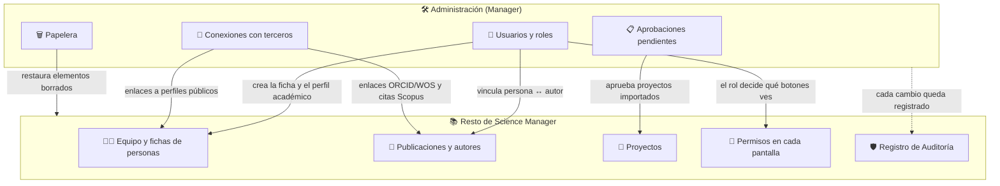

# Panel de Administración

El **Panel de Administración** es la puerta de entrada a todas las herramientas con las que el gestor del grupo mantiene Science Manager: personas, aprobaciones, importaciones, integraciones y limpieza de datos. Accede desde **Administración → Administración** en el menú lateral.

:::info[🔐 Permisos requeridos]

Consulta qué es cada rol en [Modelo de Roles y Accesos](../01-getting-started/02-roles-and-access.md).

El panel y la mayoría de sus herramientas son exclusivas del rol **Manager**. El **Reviewer** solo ve en el menú el **Registro de Auditoría** y las **Plantillas de informes**. Los roles **Contributor** y **User** no ven la sección *Administración*.

:::

*Panel de Administración visto por un Manager.*

## 🧰 Qué hay en el panel \{#que-hay-en-el-panel}

Cada tarjeta lleva a una herramienta. Pulsa en ella para abrirla.

| Tarjeta | Para qué sirve | Página |
|---|---|---|
| **Detalles del Grupo** | Datos institucionales del grupo (nombre, centro, instituto, web…). | [Configuración del grupo](./05-group-settings.md) |
| **Gestión de Usuarios** | Alta, edición, roles, estado de la cuenta y vínculos con autores. | [Gestión de Usuarios](./02-user-management.md) |
| **Aprobaciones Pendientes** | Aprobar o rechazar los proyectos importados que esperan decisión. | [Aprobaciones pendientes](./04-pending-approvals.md) |
| **Gestionar publicaciones** | Enriquecer publicaciones con Crossref y asociarlas a proyectos en bloque. | [Publicaciones](../02-core-features/02-publications.md) |
| **Importar publicaciones por DOI** | Alta de publicaciones a partir de su DOI. | [Publicaciones](../02-core-features/02-publications.md) |
| **Importar CSV de Eventos** | Carga masiva de eventos y contribuciones. | [Eventos](../02-core-features/05-events.md) |
| **Proyectos** | Gestión de proyectos de investigación. | [Proyectos](../02-core-features/01-projects.md) |
| **Registro de Auditoría** | Historial de cambios de la plataforma. | [Auditoría y papelera](./06-audit-and-trash.md) |
| **Conexiones con terceros** | Scopus y URLs de ORCID / ResearcherID. | [Configuración del grupo](./05-group-settings.md) |
| **Referencia UI** y **Configuración del sistema** | Herramientas técnicas del rol Administrador. | — |

Los catálogos compartidos (autores, entidades financiadoras y revistas) no tienen tarjeta aquí: se abren desde **Consulta** en el menú y se explican en [Catálogos y Entidades](./03-master-data.md).

:::note[Tarjetas técnicas]

**Referencia UI** y **Configuración del sistema** pertenecen al rol Administrador (el que mantiene la instalación). Aunque la tarjeta se muestre en el panel, un Manager no puede abrirlas.

:::

## 🔗 Cómo se conecta con el resto del sistema \{#como-se-conecta}

Lo que haces en Administración no es aislado: alimenta a los módulos que usa el resto del grupo. Este esquema resume las relaciones.

En la práctica:

- **Los usuarios dan identidad al resto del sistema.** Una persona dada de alta aparece en [Equipo](../02-core-features/06-team.md), puede ser investigador principal de un [proyecto](../02-core-features/01-projects.md) y recibe permisos según su rol. Sus datos de contrato se gestionan en [Vinculaciones](../02-core-features/06-employment-records.md).
- **El vínculo usuario ↔ autor une la persona con su producción.** Las [publicaciones](../02-core-features/02-publications.md) se firman con *autores*; al vincular un autor a un usuario, esas publicaciones aparecen en su [perfil](../02-core-features/10-member-profile.md) y pueden editarse por su autor.
- **El rol gobierna cada pantalla.** Cambiar el rol de alguien en Gestión de Usuarios cambia de inmediato qué botones ve (por ejemplo, **Nuevo Proyecto** solo aparece a Reviewer y Manager).
- **Todo es por grupo.** Un Manager solo gestiona usuarios y datos de su propio grupo.
- **Nada se pierde sin rastro.** Las ediciones quedan en el [Registro de Auditoría](./06-audit-and-trash.md) y lo eliminado va a la **Papelera**, de donde un Manager puede restaurarlo.
