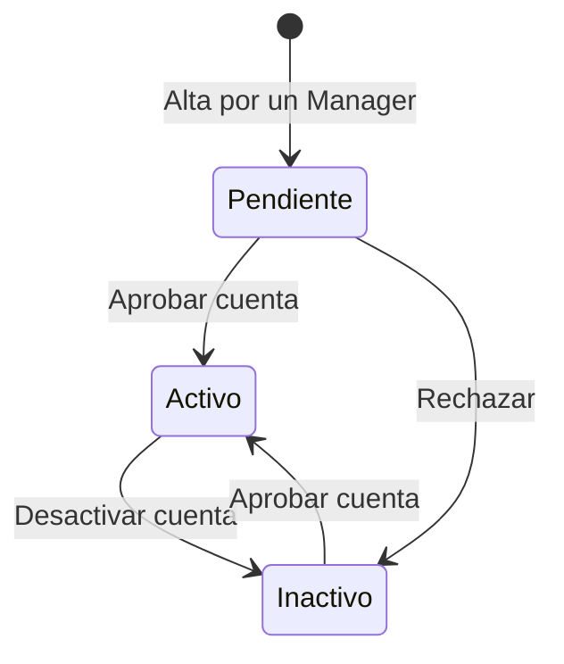

# Gestión de Usuarios

Aquí el Manager da de alta a las personas del grupo, les asigna un **rol**, controla si su cuenta está activa y vincula a cada persona con sus **autores** para que su producción científica quede asociada a ella.

:::info[🔐 Permisos requeridos]

Consulta qué es cada rol en [Modelo de Roles y Accesos](../01-getting-started/02-roles-and-access.md).

Todo lo de esta página es exclusivo del rol **Manager** (y del Administrador). El resto de roles no ve la sección *Gestión de Usuarios*.

:::

## 👥 Listado, búsqueda y filtros \{#listado-busqueda-y-filtros}

Accede desde **Administración → Gestión de Usuarios**. Arriba, cuatro contadores resumen el grupo: **Total users**, **Active**, **Pending** e **Inactive**. La tabla muestra, para cada persona, su nombre, correo, rol, estado, categoría de empleo y fecha de alta.

*Listado de usuarios con los contadores de estado.*

- **Búsqueda rápida:** el cuadro superior filtra por **nombre o email** mientras escribes.
- **Filtros:** el botón **Filtros** despliega un panel con tres grupos de casillas, que se combinan entre sí: **Estado** (Pendiente, Activo, Inactivo), **Rol** y **Categoría de empleo**. Pulsa **Aplicar filtros** para confirmarlos; **Limpiar** los elimina.
- **Paginación:** al pie eliges cuántas filas ver por página.
- **Abrir una ficha:** pulsa sobre el nombre de la persona, o usa el menú de tres puntos de su fila.

*Panel de filtros abierto: estado, rol y categoría de empleo.*

:::note[Etiquetas en inglés]

Algunos rótulos de esta tabla (**User**, **Status**, **Employment**, **Joined**, los contadores y los estados *Active* / *Pending* / *Inactive*) aún no están traducidos en la aplicación y se muestran en inglés. En el resto de pantallas de usuarios, los estados se llaman **Activo**, **Pendiente de aprobación** e **Inactivo**.

:::

## 🔄 Ciclo de vida de una cuenta \{#ciclo-de-vida-de-una-cuenta}

Toda cuenta nueva nace **pendiente de aprobación** y no puede iniciar sesión hasta que un Manager la **active**. Una cuenta **inactiva** tampoco puede entrar, y el bloqueo se aplica en cada petición: si desactivas a alguien con la sesión abierta, pierde el acceso.

Los cambios de estado se hacen desde el [detalle del usuario](#detalle-del-usuario) o desde la pantalla de [edición](#editar-un-usuario).

## ➕ Dar de alta un usuario \{#dar-de-alta-un-usuario}

Pulsa **Nuevo** en el listado.

*Formulario **Nuevo usuario**.*

1. Escribe el **Email** (único campo obligatorio).
2. Marca los **Roles del sistema** que correspondan. **Usuario (base)** va siempre marcado y no se puede quitar; los demás son **Colaborador**, **Revisor** y **Gestor**. Cada rol incluye los permisos de los inferiores (ver [Modelo de Roles y Accesos](../01-getting-started/02-roles-and-access.md)).
3. Opcionalmente rellena los **Datos personales**: **Nombre**, **Primer apellido**, **Segundo apellido**, **Nacionalidad**, **DNI / NIE / Pasaporte** y **Fecha de nacimiento**.
4. Opcionalmente completa el **Perfil académico**: **ORCID**, **ResearcherID (WOS)**, **Sexenios**, **Sexenios de transferencia** y **Director / supervisor**.
5. Pulsa **Crear usuario**. Se abre la ficha de la nueva persona.

:::warning[La cuenta nueva queda pendiente y sin contraseña usable]

El alta crea la cuenta en estado **Pendiente de aprobación** con una contraseña aleatoria que nadie conoce, y **no envía ningún correo por sí sola**. Para que la persona pueda entrar:

- Abre su ficha y pulsa **Aprobar cuenta**.
- Pulsa **Enviar invitación de contraseña** (la persona recibe un enlace válido durante 7 días para elegir su contraseña) o fija una desde **Editar usuario**.

:::

:::note[Quién puede asignar qué rol]

El rol **Administrador** solo aparece como opción cuando quien edita es a su vez Administrador: un Manager nunca puede crear otro administrador. La persona queda asignada al grupo del Manager que la da de alta.

:::

## 🪪 Detalle del usuario \{#detalle-del-usuario}

Pulsa sobre el nombre en el listado para abrir la ficha.

*Ficha del usuario: datos, acciones de administrador y autores vinculados.*

La ficha muestra identificador, correo, nombre, nacionalidad, fecha de nacimiento, DNI / NIE / Pasaporte, fecha de creación y un enlace **Ver perfil** a su ficha en [Equipo](../02-core-features/06-team.md). Arriba a la derecha, **Editar usuario** abre el formulario de edición.

### Acciones de administrador

| Botón | Qué hace | Cuándo aparece |
|---|---|---|
| **Aprobar cuenta** | Pasa la cuenta a **Activo** (pide confirmación). | Si la cuenta no está activa. |
| **Desactivar cuenta** | Pasa la cuenta a **Inactivo** (pide confirmación). | Si la cuenta no está inactiva. |
| **Enviar invitación de contraseña** | Envía al correo de la persona un enlace para establecer su contraseña, válido 7 días. | Siempre. |
| **Impersonar usuario** | Entras en la aplicación *como* esa persona, para ver exactamente lo que ve. | Solo si la cuenta está activa, no es administrador y no eres tú. |

:::warning[Impersonar: reglas]

Un Manager solo puede impersonar a **miembros de su propio grupo**. No se puede impersonar a un Administrador, a una cuenta inactiva ni a uno mismo, ni encadenar una impersonación dentro de otra: sal primero de la actual.

:::

### Autores vinculados

Los **autores** son los nombres con los que se firman las publicaciones y contribuciones. Esta sección une a la persona con sus autores, de modo que su producción aparece en su perfil.

- **Gestionar vínculos** despliega el gestor.
- **Buscar y vincular un autor existente:** escribe el nombre y pulsa **Vincular** sobre el resultado (los ya vinculados se marcan).
- **Crear y vincular un autor nuevo:** escribe el nombre de autor y pulsa **Crear**. Si el nombre ya existe, la creación falla.
- **Desvincular:** el icono junto al autor, con confirmación. El registro de autor **se conserva**; solo deja de estar asociado a la persona.

## ✏️ Editar un usuario \{#editar-un-usuario}

Desde la ficha, pulsa **Editar usuario**.

*Edición: datos, roles, perfil académico, estado y contraseña.*

El formulario agrupa cuatro bloques independientes:

1. **Datos y roles.** Cambia email, roles y datos personales, y el **Perfil académico** (ORCID, ResearcherID, sexenios, director / supervisor). Pulsa **Guardar cambios**: solo se envían los campos modificados y aparece «Cambios guardados correctamente».
2. **Estado de la cuenta.** Botón **Activar** / **Desactivar** según el estado actual.
3. **Establecer nueva contraseña.** Escribe la contraseña (el botón **Ver** la muestra) y pulsa **Establecer contraseña**.
4. **Enviar invitación de contraseña**, igual que en la ficha.

:::tip[Qué hacer cuando alguien «no puede entrar»]

1. Comprueba en el listado que su estado sea **Activo**.
2. Si lo es, pulsa **Enviar invitación de contraseña** para que fije una nueva.
3. Si nunca recibió el correo, fija una contraseña provisional desde **Editar usuario** y comunícasela por un canal seguro.

:::

## 📌 Dónde repercute lo que cambias \{#donde-repercute}

| Cambio | Efecto en el resto del sistema |
|---|---|
| **Rol** | Cambia qué módulos y botones ve la persona en cada pantalla. |
| **Estado** | Una cuenta que no esté **Activa** no puede iniciar sesión. |
| **Perfil académico** | Alimenta la ficha en [Equipo](../02-core-features/06-team.md) y el [perfil de miembro](../02-core-features/10-member-profile.md). |
| **Vínculo con autores** | Asocia a la persona sus [publicaciones](../02-core-features/02-publications.md) y contribuciones. |
| **Datos personales** | Los ven los roles Reviewer y superiores; el resto de roles solo ve los suyos. |

Más sobre cómo se relaciona la administración con el resto de módulos en el [Panel de Administración](./01-admin-panel.md#como-se-conecta).
