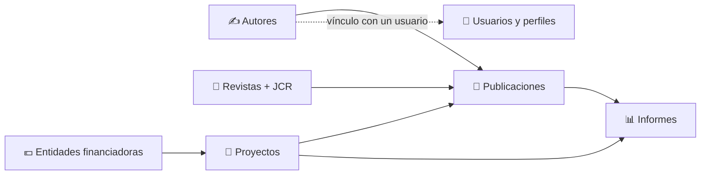

# Catálogos y Entidades

Los **catálogos** son las listas de referencia que el resto del sistema reutiliza: los **autores** que firman las publicaciones, las **entidades financiadoras** que pagan los proyectos y las **revistas** con sus métricas. Se mantienen una vez y se usan en todas partes, por eso su calidad es responsabilidad del Manager.

## 🔗 Qué alimenta cada catálogo \{#que-alimenta-cada-catalogo}

| Catálogo | Se usa en | Si está mal… |
|---|---|---|
| **Autores** | La firma de [publicaciones](../02-core-features/02-publications.md), capítulos y contribuciones. | Un mismo investigador aparece con varios nombres y su producción se reparte. |
| **Entidades financiadoras** | El campo **Entidad Financiadora** de los [proyectos](../02-core-features/01-projects.md) y su filtro. | Los proyectos quedan asociados a la entidad equivocada o duplicada. |
| **Revistas** | La revista de cada publicación, de la que hereda JIF y cuartil. | Las publicaciones muestran «Sin métricas JCR». |

:::info[🔐 Permisos requeridos]

Consulta qué es cada rol en [Modelo de Roles y Accesos](../01-getting-started/02-roles-and-access.md).

| Catálogo | Quién lo consulta | Quién lo modifica |
|---|---|---|
| **Autores** | Reviewer y Manager | Solo Manager |
| **Entidades financiadoras** | Contributor, Reviewer y Manager | Solo Manager |
| **Revistas** | Contributor, Reviewer y Manager | Solo Manager |

Los tres catálogos se abren desde la sección **Consulta** del menú. Los botones de gestión (**Añadir…**, **Editar**, **Eliminar**, **Importar**) solo aparecen a los Manager.

:::

## ✍️ Autores \{#autores}

Accede desde **Consulta → Autores**. Cada fila es un nombre de firma, con su **usuario vinculado** (si pertenece al grupo) y su fecha de creación.

*Catálogo de autores: los miembros del grupo llevan la etiqueta **Miembro** y su usuario vinculado.*

- **Búsqueda rápida:** **Buscar autores…** filtra por nombre mientras escribes.
- **Filtro:** el botón de filtros despliega **Usuario vinculado**; elige un usuario y pulsa **Aplicar filtros** (**Limpiar filtros** lo quita).
- **Ordenar:** pulsa la cabecera **Nombre** o **Fecha de creación**.
- Los autores **sin** usuario vinculado (guion en la columna) son autores externos al grupo.

:::note[Etiquetas sin traducir]

Bajo cada usuario vinculado, la categoría de empleo se muestra con su código técnico (por ejemplo **FULL_PROFESSOR**). Es un detalle de la aplicación, no un dato distinto.

:::

### Añadir, renombrar y eliminar (Manager)

1. Pulsa **Añadir autor**. Aparece una fila editable al principio de la tabla.
2. Escribe el **Nombre del autor…** y pulsa **Guardar** (o cancela).
3. Para corregir un nombre o borrarlo, abre el menú de tres puntos de la fila: **Editar** o **Eliminar**.

*Alta rápida de un autor: solo se pide el nombre.*

:::warning[Eliminar un autor]

La eliminación **no se puede deshacer** y puede afectar a las publicaciones vinculadas. La aplicación pide confirmación.

:::

### Vincular un autor con un usuario

El vínculo **no se hace en esta tabla**, sino en la ficha de la persona: **Administración → Gestión de Usuarios → ficha → Autores vinculados**. Consulta [Gestión de Usuarios](./02-user-management.md#autores-vinculados).

:::tip[Evita duplicados]

Antes de **Añadir autor**, busca el nombre (con y sin segundo apellido, con y sin acentos). Un autor duplicado reparte la producción de una misma persona entre dos registros. Cualquier usuario puede crear autores externos «al vuelo» al rellenar una publicación, así que es habitual que el Manager tenga que depurar el catálogo.

:::

## 💶 Entidades financiadoras \{#entidades-financiadoras}

Accede desde **Consulta → Entidades financiadoras**. Las entidades se organizan en dos niveles: **organismos** (por ejemplo, un ministerio) y **suborganismos** que dependen de uno (por ejemplo, una agencia).

*Entidades agrupadas por organismo; los suborganismos aparecen sangrados bajo su organismo.*

La tabla muestra **Jerarquía**, **Nombre** (con el organismo superior debajo), **Acrónimo**, **Código**, **Sitio web** y **Responsables** (personas de contacto de la entidad). Dispones de **Buscar entidades…** y de un filtro por **Organización superior**.

### Crear una entidad (Manager)

Pulsa **Nueva entidad financiadora**. El formulario tiene dos pestañas: **Manual Entry** (una entidad) y **CSV Upload** (varias a la vez).

*Alta de un suborganismo: el campo **Parent organism** (resaltado) solo aparece para ese nivel.*

1. Elige el **Hierarchy level**: **Organism (top level)** o **Sub-organism (depends on an organism)**.
2. Si es un suborganismo, selecciona su **Parent organism**.
3. Escribe el **Name** (obligatorio) y, opcionalmente, **Acronym**, **Administrative code** y **Website**.
4. Añade las personas de contacto con **Add responsible** (cada una pide **Name**, **Email** y **Organization**).
5. Pulsa **Create Funding Entity**.

:::note[Formulario en inglés]

Esta pantalla aún no está traducida; los nombres de campos y botones son los que se muestran arriba en inglés.

:::

:::warning[El código administrativo debe ser único]

El **Administrative code** es el código oficial de la entidad. No puede repetirse y es la clave con la que la **carga por CSV** reconoce una entidad ya existente.

:::

Desde el menú de tres puntos de cada fila el Manager puede **editar** o **eliminar** la entidad. Eliminarla **no se puede deshacer** y puede afectar a los proyectos que la tengan asignada.

## 📰 Revistas y métricas JCR \{#revistas-y-metricas-jcr}

Las revistas se explican en su propia página: [Revistas](../02-core-features/09-journals.md). Desde la administración te interesa sobre todo la **importación de métricas**.

### Importar datos JCR (Manager)

En **Consulta → Revistas**, el botón **Importar JCR** abre la pantalla de importación.

*Importación de métricas JCR desde un CSV de Clarivate.*

1. Pulsa **Seleccionar fichero CSV** y elige el fichero exportado de Clarivate / JCR.
2. Indica el **Año de citación**. El año **no viene en el CSV**: lo eliges tú.
3. Revisa la vista previa (primeras filas) y pulsa **Importar**.
4. Al terminar se muestra un resumen: **Filas procesadas**, **Revistas creadas / actualizadas**, **Citaciones creadas / actualizadas**, **Categorías creadas** y los **Errores** de cada fila que no se pudo importar.

:::warning[Cómo se reconocen las revistas]

La revista se busca por **nombre** o por **abreviatura JCR**. Las que no se encuentran se **crean automáticamente**: si el nombre del CSV difiere ligeramente del catálogo, aparecerá una revista duplicada. Revisa el recuento de **Revistas creadas** tras cada importación.

:::

:::tip[Cuándo importar]

Importa el CSV de cada año cuando Clarivate publique los nuevos indicadores. Las publicaciones ya vinculadas heredan las nuevas métricas sin tocarlas.

:::
