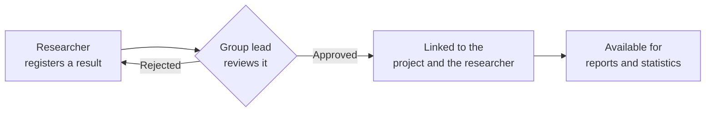

# Introduction to Science Manager

**Science Manager** is the platform where your research group brings together, in one place, everything it produces: scientific articles, projects, conferences, patents, outreach activities, and every researcher's profile.

Instead of keeping that information scattered across spreadsheets, emails, and shared folders, Science Manager gives you a **single source of truth**: every piece of data is entered once and stays available for the whole academic life of the group — for lookup, tracking, and reporting.

## What does this mean for you?

If you belong to a research group, Science Manager lets you:

- **Register your publications** and other research outputs (conferences, patents, outreach, book chapters) in a few minutes.
- **Keep your academic profile up to date**: ORCID, category, research sexennials, contract history.
- **See at a glance** what you've published, which projects you're part of, and the status of everything you've submitted.
- **Stop chasing impact factors by hand**: the platform resolves them automatically from official citation data.
- **Generate reports** (for accreditation, project memos, calls for funding) without collecting data from half a dozen different places.

## A simple workflow

Whether you're a principal investigator, a professor, or a PhD student, every research output follows the same path.

1. You **register** a publication, conference, patent, or any other result.
2. It stays *pending* until the principal investigator or the group administrator **reviews and approves** it.
3. Once approved, the result is **linked** to you, to the corresponding project, and, if applicable, to the journal — with its impact factor and quartile already resolved.
4. From there, it becomes part of the group's **reports and statistics**, without anyone having to type it in again.

## Who uses Science Manager?

| Profile | What they do on the platform |
|---|---|
| **Principal Investigator (PI)** | Oversees the group's output, approves activities, and checks impact indicators. |
| **Professor / Researcher** | Registers their publications and results, keeps their academic profile current. |
| **PhD student** | Registers their contributions and keeps their profile linked to their thesis director. |
| **Group administrator** | Manages users, imports data, and configures journals and funding entities. |

## Next steps

Continue with the Roles and Access Model section to understand what each profile can see and do, or jump straight to Research Projects if you already know your role.

:::note
The rest of this documentation is still being translated into English. In the meantime, the sidebar links to the Spanish version of untranslated pages.
:::
